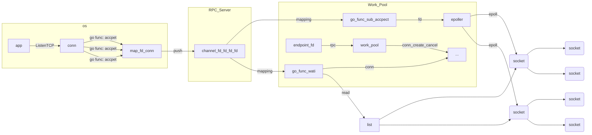

# Plato项目学习笔记


## 项目背景


## 技术问题

##### 在一个长连接IM服务中，如果用户在连接到网关后换了一个基站(链接断开了要重连)，怎么解决？

1. 用户连接到网关，建立长连接，获取Session ID。
2. 用户移动，基站切换，TCP连接断开。
3. 客户端检测到心跳超时，触发重连逻辑。
4. 客户端携带Session ID向网关发起重连请求。
5. 网关验证Session ID，恢复会话状态，并推送断连期间的未读消息。
6. 客户端收到消息，更新UI，用户无感知地继续使用。


##### TCP本身不是有心跳吗？为什么要自定义心跳

TCP协议本身确实提供了keep-alive机制，可以用来检测连接是否存活。

在IM服务等需要高实时性、可靠性的场景中，TCP的keep-alive存在以下局限性，导致它无法完全满足需求：

1. **检测时间太长**

默认配置下，TCP keep-alive的检测周期非常长（可能需要几分钟甚至几小时才能确认断连）。例如，默认2小时空闲时间加上9次探测（75秒/次），总共可能超过2小时才能发现连接失效。


2. **参数调整受限**

虽然可以通过系统调用（如setsockopt）调整keep-alive的参数，但这些调整是全局的，影响服务器或客户端上的所有TCP连接。IM服务可能与其他服务共用同一主机，无法为IM单独优化。


3. **仅检测网络层状态**


只能检测网络层的连接是否存活。IM服务需要更细粒度的状态检测，例如确认对端是否还能正常处理消息，而不仅仅是网络连接是否存在。


4. **缺乏业务逻辑**

- TCP keep-alive只是简单地发送空包，无法携带业务数据。如果IM服务需要通过心跳顺便同步状态（如用户在线状态、未读消息数），keep-alive无法做到。
- 自定义心跳可以设计为包含业务信息，比如客户端发送心跳时附带当前时间戳，服务器返回未读消息数量或会话状态。


5. **中间设备干扰**


##### 对业务的规模有了解吗

整个业务大概是200w左右的qps，实现架构升级后，单机目标要维持50w左右的长链接(单机64G内存)


##### 应用层协议与WebSocket的比较：

1. Plato-go使用基于TCP的自定义二进制协议，而WebSocket是基于HTTP的标准协议。
2. Plato-go协议结构：消息头(8字节)+消息体，包含消息类型(1字节)、消息ID(4字节)、消息长度(2字节)和校验和(1字节)，消息体使用Protobuf序列化。相比之下，WebSocket协议有更复杂的帧结构，包含FIN、RSV、opcode、mask等字段。
3. 性能方面：Plato-go协议更轻量，头部仅8字节，而WebSocket帧头至少2字节，最多可达14字节；Plato-go使用Protobuf序列化，比WebSocket常用的JSON更高效。
4. 功能方面：Plato-go实现了自定义的心跳机制、消息确认和断线重连；WebSocket有内置的ping/pong机制但需要额外实现消息确认和会话恢复。
5. 兼容性：WebSocket被广泛支持，跨平台性更好；Plato-go协议需要客户端和服务端都实现相同的协议解析。


## IM系统相关的概念


##### P2P


由A直接连接B的模式叫P2P


##### 上行消息和下行消息

A客户端发给服务器的消息叫上行消息

服务器发给B客户端的消息叫下行消息


##### 消息风暴

“消息风暴”通常指的是由于某种原因导致的消息流量突然激增的现象。这可能是由群聊、即时通讯软件或其他类型的分布式系统中发生的大量消息快速传播所引起的。例如，在群消息场景下，如果一条消息被迅速转发给大量用户，可能会造成服务器负载骤增，形成所谓的“消息风暴扩散系数”，从而对系统的实时性、可达性和离线消息处理带来挑战。


##### P99

在所有请求中，有 99% 的请求响应时间不超过这个值。换句话说，只有 1% 的请求会比 P99 值更慢。


##### QPS

QPS 表示每秒钟系统接收到并处理的请求数量。


##### L1——L7


| 层级 | 名称       | 功能                                                         |
| ---- | ---------- | ------------------------------------------------------------ |
| L1   | 物理层     | 负责在各种媒介上传输原始的比特流。包括物理设备如网卡、网线、集线器等。确定信号的电压、电流、无线电频率等。 |
| L2   | 数据链路层 | 提供点到点的数据传输。负责帧的创建、传输和接收。检测并纠正物理层传输中的错误。使用MAC地址进行硬件寻址。 |
| L3   | 网络层     | 负责数据包的路径选择和转发。提供逻辑地址（如IP地址）用于多跳传输。进行路由选择，决定数据包如何在网络中转发。 |
| L4   | 传输层     | 提供端到端的可靠传输和错误恢复。使用传输协议（如TCP和UDP）确保数据完整性和顺序。实现流量控制和端口寻址。 |
| L5   | 会话层     | 管理应用程序之间的会话。负责建立、维护和终止会话。提供对话控制和同步服务。 |
| L6   | 表示层     | 处理数据的格式化和翻译。负责数据加密、解密、压缩和解压缩。确保不同系统之间的数据表示一致。 |
| L7   | 应用层     | 为用户提供各种网络应用服务。包含常见的网络应用协议（如HTTP、FTP、SMTP等）。负责应用程序之间的通信。 |


##### 系统中的各种id


| 名称          | 定义                                     |
| ------------- | ---------------------------------------- |
| **connID**    | 连接ID，用于唯一标识一个网络连接。       |
| **clientID**  | 客户端ID，用于唯一标识一个客户端设备。   |
| **seqID**     | 序列号，用于标识消息在一条连接中的顺序。 |
| **sessionID** | 会话ID，用于标识一个会话。               |
| **msgID**     | 消息ID，用于唯一标识一条消息。           |
| **Device ID** |                                          |


## IM系统要解决的问题


### 消息问题


#### 消息的一致性


**一致性**:任意时刻消息保证与发送端顺序一致。


**消息的端到端一致性 = 上行消息一致 + 服务端业务一致 + 下行消息一致**


**IM消息的一致性体现在：**


- 1）单聊时：要保证发送方发出聊天消息的顺序与接收方看到的顺序一致；
- 2）群聊时：要保证所有群员看到的聊天消息，与发送者发出消息时的绝对时间序是一致的。


##### 没有全局时钟


一个真正堪用的生产系统，显示不可能所有服务都跑在一台服务器上，分布式环境是肯定的。

**那么：**在分布式环境下，客户端+服务端后台的各种后台服务，都各自分布在不同的机器上，机器之间都是使用的本地时钟，没有一个所谓的“全局时钟”（也没办法做到真正的全局时钟），那么所谓的消息时序也就没有真正意义上的时序基准点。所以消息时序问题显然不是“本地时间”可以完全决定的。


##### 多发送方问题


服务端分布式的情况下，不能用“本地时间”来保证时序性，那么能否用接收方本地时间表示时序呢？

遗憾的是，由于多个客户端的存在（比如群聊时），即使是一台服务器的本地时间，也无法表示“绝对时序”。

**如上图所示：**绝对时序上，APP1先发出msg1，APP2后发出msg2，都发往服务器web1，网络传输是不能保证msg1一定先于msg2到达的，所以即使以一台服务器web1的时间为准，也不能精准描述msg1与msg2的绝对时序。


##### 多接收方问题


多发送方不能保证时序，假设只有一个发送方，能否用发送方的本地时间表示时序呢？遗憾的是，由于多个接收方的存在，无法用发送方的本地时间，表示“绝对时序”。

如上图，绝对时序上，web1先发出msg1，后发出msg2，由于网络传输及多接收方的存在，无法保证msg1先被接收到先被处理，故也无法保证msg1与msg2的处理时序。


##### 网络传输与多线程问题


既然多发送方与多接收方都难以保证绝对时序，那么假设只有单一的发送方与单一的接收方，能否保证消息的绝对时序一致性呢？

结论是悲观的，由于网络传输与多线程的存在，这仍然不行。web1先发出msg1、后发出msg2，即使msg1先到达（网络传输其实还不能保证msg1先到达），由于多线程的存在，也不能保证msg1先被处理完。


---


#### 消息的可靠性


**可靠性**: 消息一旦显示发送成功就必定送达到对端(即A发出消息后，必须确保B可以收到)


在传递给业务层时服务端进程崩溃，但客户端A认为已经送达，服务端业务层无感知,因此**消息丢失。**


**多客户端发送消息/多服务端接收消息/多线程多协程处理消息**，顺序难以确定。


设计IM必须具有[端到端的设计思维](https://blog.csdn.net/do_best_/article/details/79755904)，底层对可靠性的保证仅能保证底层的可靠，而不能保证上层的可靠, 底层的可靠仅是减小了发生故障的概率:  **底层可靠不等于上层可靠，同理: 底层一致不等于上层一致**


---


#### 消息的幂等性


**定义**：**消息幂等性**指在即时通讯（IM）系统中，无论同一条消息被重复发送、传输或处理多少次，最终的结果（如消息状态、内容展示等）与仅处理一次的效果完全一致。
​**​核心目标​**​：避免因网络重传、客户端重发、服务端重复消费等场景导致消息重复生效（如重复扣款、重复通知等）。


#####  消息幂等性的必要性

1. 网络不确定性
   - 消息可能因超时、丢包被客户端或服务端多次重传。
2. 客户端容错
   - 用户网络恢复后，客户端可能主动重发未收到ACK的消息。
3. 服务端可靠性
   - 消息队列（如Kafka）可能重复投递消息，或服务端宕机后恢复时重复处理未确认的消息。


---


##### 技术挑战与解决方案

**挑战1：消息的唯一标识**

- **问题**：如何唯一标识一条消息，确保不同消息不会因重复传输导致混淆。

  **解决方案**

  - **全局唯一ID（UUID/GUID）**：
    服务端为每条消息生成全局唯一ID（如Snowflake算法），客户端和服务端均基于此ID去重。
  - **业务关联ID**：
    对于特定业务场景（如支付订单），使用业务方提供的唯一订单号作为消息ID。

**挑战2：消息状态的持久化与同步**

- **问题**：如何在分布式系统中记录消息的处理状态（已读、已送达、已消费），避免状态不一致。

**挑战3：消息顺序性与并发控制**

- **问题**：消息可能乱序到达，导致幂等处理失效（如先处理后一条消息的撤销操作，再处理前一条）。

  **解决方案**

  - **分桶有序处理**：
    按业务分组（如用户ID分片）或消息ID哈希值分桶，保证单桶内消息有序。
  - **版本号机制**：
    为消息附加递增版本号，服务端仅处理版本号等于当前状态的最新消息。

**挑战4：存储与性能的权衡**

- **问题**：去重表可能成为性能瓶颈，尤其是高并发场景下频繁的插入和查询。

**挑战5：业务逻辑的幂等性设计**

- **问题**：某些业务操作天然不具备幂等性（如转账、库存扣减）。


---


### 长链接接入层技术挑战


长链接接入层主要解决的问题就是 **实现服务端主动及时地将消息发送给客户端的功能。而在这个过程中，会有非常多的技术挑战:**


1. 客户端如何选择网关IP地址? 才能降低延迟，保证连接可靠，负载均衡?
2. 网关服务如何接收客户端的消息，获得最大的并发度获得消息的高吞吐，低延迟?
3. 为了能使用长连接收发消息，需要维护哪些状态，如何使其占用更少的内存，单机承载更多的连接？
4. 业务层是怎么感知到连接在哪一个网关机器，并把消息分发下去的呢? 如何降低网络请求的扇出?
5. 客户端进入地铁/切换基站/连接wifi 等情况导致连接断开，如何能快速重连，而不影响用户体验?
6. 如何尽可能的减少长连接服务的崩溃/重启次数，做到永不宕机?
7. 长连接服务如何做限流/熔断/降级策略? 实现对网关的过载保护,提高可靠性?
8. 长连接服务如何做到通用性，灵活对接各种业务场景?
9. 如何多数据中心部署长连接网关?


## 消息协议设计


### 协议目标


【性能】协议传输效率，尽可能的降低端到端延迟。

【兼容】既要向前兼容也要向后兼容。

【存储】减少消息包的大小，降低空间占用率。

【计算】减少编解码时造成的CPU使用率的权衡。

【网络】尽可能的减少网络带宽消耗。

【安全】协议安全性，防止协议被破解。

【迭代】尽可能的灵活扩展，支持IM复杂业务的演进。

【通用】可跨平台接入，H5，客户端，IoT设备。

【可读】易于理解，方便调试。


### 消息协议各层技术选型介绍


|        |                                                              |                                                              |
| ------ | ------------------------------------------------------------ | ------------------------------------------------------------ |
| 应用层 | 文本协议:      可读性好，性能低。二进制协议: 可读性差，难以调试，性能高，业界无可争议的使用 [protobuf](https://colobu.com/2015/01/07/Protobuf-language-guide/) |                                                              |
| 安全层 | 基于**密钥的生命周期**可以划分为:<br />1.**TLS/SSL**: 加密效果好，但证书管理相对复杂。<br />2.**固定加密**: 通信前客户端和服务端约定好密钥和加密算法。<br />3.**一人一密**: 在通信前客户端先向服务端请求密钥，服务端会用用户特有属性生成密钥下发下去，然后进行加密通信。<br />4.**一次一密**: 创建连接建立一次会话时，双方进行加密三次握手，使用非对称加密握手,对称加密传输, 参考TLS握手过程。 <br />**加密消耗cpu计算资源，安全性也要考虑消息在服务端存储的安全性和合规性要求，要做出取舍。**网关对数据包进行TLS3.0协议的密钥协商握手，加解密操作，这会消耗大量CPU,所以对于加解密操作可以使用GPU。<br />参考: [通俗易懂:一篇掌握即时通讯的消息传输安全原理](http://www.52im.net/thread-970-1-1.html) | [TLS3.0协议](http://www.bewindoweb.com/271.html)+网关终止 |
| 传输层 | TCP: 面向连接的可靠传输协议，仅能保证数据到达传输层，维护状态消耗资源，网络不稳定时频繁重连性能差。UDP: 无状态的传输协议，弱网环境更优。<br />参考: [网络是怎样连接的](https://book.douban.com/subject/26941639/)，[深入解析QUIC协议](https://segmentfault.com/a/1190000041234654) | TCP保证数据可靠传输到服务器，减少复杂度，使用epoll技术以及应用层设计，可以克服有状态链接的弊端。参考: [基维百科](https://zh.wikipedia.org/wiki/传输控制协议) |


### 市面上开源协议对比

好的，以下是表格内重新编号的内容：

| 名称                                                         | 特性                                                         | 取舍                                                         |
| ------------------------------------------------------------ | ------------------------------------------------------------ | ------------------------------------------------------------ |
| [IMPP](https://rfc2cn.com/rfc2778.html)                      | 1. [RFC2798](https://rfc2cn.com/rfc2778.html) ｜ [RFC2799](https://rfc2cn.com/rfc2779.html)<br>2. 这是一个协议标准，没有具体实现<br>3. 其中涉及的角色具有参考意义，是非常通用的设计 | 1. 太过抽象/通用, 可读性差<br>2. 仅是一个模型，跟自研没什么区别 |
| [XMPP](https://zh.wikipedia.org/zh-hans/可扩展消息与存在协议) | 1. 一种基于XML的应用层协议<br>2. XML可以跨平台，跨IM服务传输<br>3. 适用于一些邮箱应用如Spark<br>4. [开源地址](https://github.com/mellium/xmpp) | 1. 文本协议性能差，信息冗余压缩率低<br>2. 解析dom极耗时，性能极差<br>3. 难以保证消息可靠性Qos |
| [SIMPLE](https://rfc2cn.com/rfc3428.html)                    | 1. [SIP协议RFC](https://datatracker.ietf.org/doc/html/rfc3428)，应用于流媒体，音视频场景，这是对其的扩展<br>2. 简单了解看[这里](https://www.cnblogs.com/xiaxveliang/p/12434170.html)<br>3. 针对IM聊天场景的扩展，是应用层文本协议，类似HTTP<br>4. [开源协议地址](https://github.com/RestComm/sip-servlets)<br>5. [详细介绍看这里](https://github.com/TongxinV/oneBook/tree/master/0.0.Document update catalog/class) | 1. 文本协议，压缩率低，**占用网络带宽**<br>2. 没有找到直接相关的SIMPLE，SIP/SDP都需要较大改造成本<br>3. 不满足性能与可迭代性<br>4. 难以保证消息可靠性Qos |
| [MQTT](https://bbs.huaweicloud.com/blogs/196152)             | 1. 异步通信，消息报文简单，适合推送场景<br>2. 轻量级发布订阅模式, 一对多的分发模式, 资源消耗也很少<br>3. 代码少，可以在多种单片机上轻松实现<br>4. 支持QoS(0-2)<br>5. 适用于设备的存储和网络带宽有限的物联网场景<br>6. [【必读】详细资料](http://www.52im.net/thread-525-1-1.html) | 1. 需要增加可变头并做一些改进，才能支持**时序性**<br>2. 基于IM需求定制化开发的场景很多，**扩展性差** |
| [websocket](https://datatracker.ietf.org/doc/html/rfc6455)   | 1. 客户端和服务端仅需要一次握手就可以创建链接<br>2. 使用简单，支持全双工，各大浏览器均支持，多用于H5<br>3. 复用HTTP通道，在HTTP基础上进行协议升级<br>4. 基于[数据帧](https://datatracker.ietf.org/doc/html/rfc6455#section-5.2)格式进行传输<br>5. [【必读】详细看这里](http://www.52im.net/forum.php?mod=viewthread&tid=1341&highlight=websocket)<br>6. [源码地址](https://github.com/gobwas/ws)<br>7. [性能压测对比](https://colobu.com/2015/07/14/performance-comparison-of-7-websocket-frameworks/)<br>8. [协议格式](https://www.cnblogs.com/zhangmingda/p/12678630.html) | 1. 需要业务自己保证消息**时序性**<br>2. 需要业务**处理断线重连**等场景，**扩展性弱**<br>3. 建立长链接时，需要通过HTTP协议升级，建立和重连都很慢<br>4. 数据帧格式定制化能力较差，信息有冗余<br>5. 原生客户端难以扩展，协议库需要二次开发<br>6. websocket的协议还是字符流协议，**信息压缩率差，浪费带宽** |
| 自研二进制协议                                               | 1. 几乎主流IM APP公司都这么做<br>2. 灵活/高效/难以破解       | 1. **通用性差**，不易扩展<br>2. 需要手写字节流处理逻辑，容易出错，**迭代效率低** |
| 私有协议+开源序列化                                          | 1. 克服了自研二进制协议的**通用性和维护性**的问题<br>2. [Protobuf](http://www.52im.net/thread-277-1-1.html)<br>3. [【必读】详细原理](http://www.52im.net/thread-323-1-1.html) | 1. 完美的选择                                                |


### 市面上网络框架性能对比


使用三台C3.4xlarge AWS服务器做测试。 一台作为服务器，两台作为客户端机器， 每台客户端机器启动10个client,一共20个client


- 20 clients
- setup rate设为500 * 20 requests/second = 10000 request /second
- 每个client负责建立50000个websocket 连接
- 等1,000,000个websocket建好好，发送一个消息(时间戳)给所有的客户端，客户端根据时间戳计算latency
- 如果服务器setup rate建立很慢，主动停止测试
- 监控三个阶段的性能指标： setup时， setup完成后应用发呆(idle)时，发送消息时


| 框架名称     | 框架初始化时 CPU 占用 (%) | 框架初始化完成时 CPU 占用 (%) | 框架初始化完成时 内存使用 (GB) | 发送消息时 CPU 占用 (%)             | 消息延迟 数量 (count) | 消息延迟 最小值 (ms) | 消息延迟 最大值 (ms) | 消息延迟 平均值 (ms) | 消息延迟 标准差 (ms) | 消息延迟 中位数 (ms) | 消息延迟 99% (ms) | 消息延迟 99.9% (ms) |
| ------------ | ------------------------- | ----------------------------- | ------------------------------ | ----------------------------------- | --------------------- | -------------------- | -------------------- | -------------------- | -------------------- | -------------------- | ----------------- | ------------------- |
| **Netty**    | 10                        | 0                             | 1.68                           | 25                                  | 50000                 | 0                    | 18301                | 2446.09              | 3082.11              | 1214.00              | <= 13274.00       | <= 18301.00         |
| **Undertow** | 10                        | 0                             | 4.02                           | 35                                  | 50000                 | 1                    | 11948                | 1366.86              | 2007.77              | 412.00               | <= 8051.00        | <= 11948.00         |
| **Node.js**  | 6                         | 0                             | 5.0                            | 6                                   | 50000                 | 0                    | 18                   | 1.27                 | 3.08                 | 1.00                 | <= 1.00           | <= 15.00            |
| **Vert.x**   | 5                         | 0                             | 6.37                           | 24 ~ 53                             | 50000                 | 49                   | 18949                | 10427.00             | 5182.72              | 10856.00             | <= 18658.00       | <= 18949.00         |
| **Go**       | 6                         | 0                             | 15                             | 6                                   | 50000                 | 0                    | 35                   | 1.89                 | 1.83                 | 1.00                 | <= 4.00           | <= 34.00            |
| **Grizzly**  | 80                        | 80                            | 11.5                           | 无法正常建立websocket，主动终止测试 | -                     | -                    | -                    | -                    | -                    | -                    | -                 |                     |
| **Spray**    | 20                        | 20                            | -                              | 无法正常建立websocket，主动终止测试 | -                     | -                    | -                    | -                    | -                    | -                    |                   |                     |
| **Jetty**    | 98                        | 98                            | 5                              | 无法正常建立websocket，主动终止测试 | -                     | -                    | -                    | -                    | -                    | -                    | -                 |                     |


### Plato自研基本消息协议技术选型


> 对于传输层，我们选择**TCP协议**，安全层选择**TLS协议**，应用层选择 **自研二进制协议+开源序列化协议**


##### 选TCP的原因

TCP 协议保障了消息可靠的传送到网关服务上，相对于udp来说少处理很多bad case，简化开发成本，同时可以通过在业务层实现**断线重连等弱网优化手段，来应对弱网环境tcp频繁断链的情况。**


##### 选TLS3.0的原因

TLS3.0协议，优化了握手的速度提升了性能，同时可以较好的兼顾性能和安全性是一个高性价比选择，但是如果在gateway server上实现，由于TLS的握手/加解密都是cpu密集型操作，极端情况下会拉高gateway server的cpu使用率使其造成性能抖动。

为此我们选择 在L7层负载均衡器上实现**TLS终止**，使用L7层负载均衡器会增加一跳的数据包的转发这会造成性能损耗，不过可以使用TLS加速卡(因特尔 QAT)等[硬件加速技术](https://developer.aliyun.com/article/597750)解决。

对于IM场景，如果仅考虑性能的话，可以在L4负载均衡器上实现TLS终止，减少对L7负载均衡器的依赖，因为gateway server本身也工作在L7层。

对于应用层一个简单灵活的二进制协议实现可以分为固定消息头,变长消息头,消息体三部分。


##### plato数据格式

对于应用层一个简单灵活的二进制协议实现可以分为固定消息头,变长消息头,消息体三部分。

 


##### 编解码器伪代码


```java
/**
 * 消息实体类，包含协议头和协议体
 */
public class Message {
    private FixedHeader fixedHeader;  // 固定头部
    private PBData varHeader;         // 可变头部（Protobuf二进制数据）
    private PBData msgBody;           // 消息体（Protobuf二进制数据）

    // Getter/Setter方法
}

/**
 * 固定头部结构，对应TCP协议中的协议头
 */
public class FixedHeader {
    private byte version;             // 协议版本（1字节）
    private byte msgType;             // 消息类型（1字节，如0x01表示文本，0x02表示心跳）
    private int msgLen;               // 总消息长度（FixedHeader + VarHeader + MsgBody，4字节大端序）
    private int varHeadLen;           // 可变头部长度（4字节大端序）
    private int crc32Sum;             // CRC32校验和（4字节，用于数据完整性校验）

    // 构造方法
    public FixedHeader(byte version, byte msgType, int msgLen, int varHeadLen, int crc32Sum) {
        this.version = version;
        this.msgType = msgType;
        this.msgLen = msgLen;
        this.varHeadLen = varHeadLen;
        this.crc32Sum = crc32Sum;
    }

    // Getter/Setter方法
}
```

​	

>  编码器


```java
import io.netty.buffer.ByteBuf;
import io.netty.channel.ChannelHandlerContext;
import io.netty.handler.codec.MessageToByteEncoder;

/**
 * 自研协议编码器：将Message对象编码为字节流
 */
public class MessageEncoder extends MessageToByteEncoder<Message> {

    @Override
    protected void encode(ChannelHandlerContext ctx, Message msg, ByteBuf out) throws Exception {
        FixedHeader fixedHeader = msg.getFixedHeader();
        PBData varHeader = msg.getVarHeader();
        PBData msgBody = msg.getMsgBody();

        // 1. 写入FixedHeader字段（共14字节）
        out.writeByte(fixedHeader.getVersion());     // 版本号（1字节）
        out.writeByte(fixedHeader.getMsgType());     // 消息类型（1字节）
        out.writeInt(fixedHeader.getMsgLen());       // 总消息长度（4字节，大端序）
        out.writeInt(fixedHeader.getVarHeadLen());   // 可变头部长度（4字节）
        out.writeInt(fixedHeader.getCrc32Sum());     // CRC32校验和（4字节）

        // 2. 写入VarHeader（Protobuf序列化后的二进制数据）
        byte[] varHeaderBytes = varHeader.toByteArray();
        out.writeBytes(varHeaderBytes);              // 直接写入字节数组

        // 3. 写入MsgBody（Protobuf序列化后的二进制数据）
        byte[] msgBodyBytes = msgBody.toByteArray();
        out.writeBytes(msgBodyBytes);                // 直接写入字节数组
    }
}
```


> 解码器


```java
import io.netty.buffer.ByteBuf;
import io.netty.channel.ChannelHandlerContext;
import io.netty.handler.codec.ByteToMessageDecoder;
import java.util.List;

/**
 * 自研协议解码器：从字节流中解析Message对象
 * 解决TCP粘包/拆包问题，按FixedHeader -> VarHeader -> MsgBody顺序解析
 */
public class MessageDecoder extends ByteToMessageDecoder {

    @Override
    protected void decode(ChannelHandlerContext ctx, ByteBuf in, List<Object> out) throws Exception {
        // 1. 确保至少有FixedHeader的14字节（1+1+4+4+4）
        if (in.readableBytes() < 14) {
            return;  // 数据不足，等待下一次读取
        }

        // 2. 标记当前读指针位置（用于异常回滚）
        in.markReaderIndex();

        try {
            // 3. 读取FixedHeader字段
            byte version = in.readByte();           // 版本号（1字节）
            byte msgType = in.readByte();           // 消息类型（1字节）
            int msgLen = in.readInt();              // 总消息长度（4字节，大端序）
            int varHeadLen = in.readInt();          // 可变头部长度（4字节）
            int crc32Sum = in.readInt();            // CRC32校验和（4字节）

            // 4. 校验数据完整性：确保后续数据足够
            if (in.readableBytes() < varHeadLen + msgLen) {
                in.resetReaderIndex();  // 数据不足，回滚到标记位置
                return;
            }

            // 5. 读取VarHeader（Protobuf二进制数据）
            byte[] varHeadBytes = new byte[varHeadLen];
            in.readBytes(varHeadBytes);             // 读取可变头部
            PBData varHeader = PBData.parseFrom(varHeadBytes);  // 反序列化为Protobuf对象

            // 6. 读取MsgBody（业务数据）
            byte[] msgBodyBytes = new byte[msgLen]; // 注意：msgLen包含FixedHeader自身长度？
            in.readBytes(msgBodyBytes);             // 读取消息体
            PBData msgBody = PBData.parseFrom(msgBodyBytes);    // 反序列化为Protobuf对象

            // 7. 校验CRC32（需根据业务逻辑实现）
            if (!validateCRC32(varHeadBytes, msgBodyBytes, crc32Sum)) {
                throw new RuntimeException("CRC32校验失败");
            }

            // 8. 构建Message对象并输出到Pipeline
            FixedHeader fixedHeader = new FixedHeader(version, msgType, msgLen, varHeadLen, crc32Sum);
            Message message = new Message(fixedHeader, varHeader, msgBody);
            out.add(message);

        } catch (Exception e) {
            in.resetReaderIndex();  // 异常时回滚读指针
            throw e;
        }
    }

    /**
     * CRC32校验逻辑（需根据实际业务实现）
     */
    private boolean validateCRC32(byte[] varHeadBytes, byte[] msgBodyBytes, int crc32Sum) {
        CRC32 crc32 = new CRC32();
        crc32.update(varHeadBytes);  // 更新校验和计算
        crc32.update(msgBodyBytes);
        return crc32.getValue() == crc32Sum;  // 比较计算值与接收值
    }
}
```


## 消息方案设计


---


### 备选方案讨论


#### 上行消息


| 方案                                | 收益                                                         | 代价                                                         |
| ----------------------------------- | ------------------------------------------------------------ | ------------------------------------------------------------ |
| **clientID 严格递增**               | 1. 任意时刻仅存储一个消息ID<br>2. 保证严格的有序性<br>3. 实现简单，可用<br>4. 长连接通信延迟低<br>5. 以发送方顺序为标准(权衡) | 1. 弱网情况下，消息丢包严重时将造成大规模消息重发，导致网络瘫痪影响消息及时性。<br>2. 无法保证群聊中的消息因果顺序 |
|                                     |                                                              | 弱网问题，可以通过优化传输协议层(比如协议升级为Quic)来优化，长连接不适合在弱网环境工作，丢包和断线属于传输层问题。 |
| ***\*****clientID 链式引用*****\*** | 1. 客户端A使用本地时间戳作为clientID，并在每次发送消息的时候携带上个消息的clientID。<br>2. 服务端存储上一个消息的clientID记作为preClientID，只有preClientID 和当前消息的preClientID对比，匹配上则说明消息未丢失，否则拒绝。 | 1. 协议的消息带宽                                            |
| **clientID 滑动窗口**               | 1. 减少弱网重传时的消息风暴问题<br>2. 使用此 client List 作为滑动窗口，来保证消息幂等等 | 1. 实现更加复杂<br>2. 网关层需要更多内存维护连接状态<br>3. 由于传输层使用tcp，已经对弱网有一定的优化，应用层也维护滑动窗口收益不大 |


#### 消息转发


> **为什么要分配seqID?**


IM场景中聊天会话至少有两个客户端参与(单聊/群聊),因此任何一个客户端分配的clientID都不能作为整个会话内的消息ID，否则会产生顺序冲突，因此clientID仅是保证消息按客户端A发送的顺序到达服务端，服务端需要在整个会话范围内分配一个全局递增的ID。

**事实上仅需要保证同一个客户发送消息的先后顺序即可。** 


---


| 挑战                                                         | 方案                                                         | 代价                                                         | 收益                                                         |
| ------------------------------------------------------------ | ------------------------------------------------------------ | ------------------------------------------------------------ | ------------------------------------------------------------ |
| **如果服务端在分配seqID前此请求失败或进程崩溃怎么办？**      | 服务端在分配SeqID之后再回复ACK消息。                         | - ack回复变慢，收发消息变慢<br>- 如果消息存储失败消息将丢失<br>- seqID 分配成为性能瓶颈 | - 保证了分配seqID消息的可用性                                |
| **如果服务端在存储消息、业务处理、接入层路由时失败怎么办？** | 1. 消息存储后再回复ACK，如果ACK失败则客户端重试时再次等待回复ACK。<br>2. 如果服务端崩溃导致长连接断开，客户端重新建立连接时发送pull信令拉取历史消息进行补洞。<br>3. 如果消息存储后仅是业务层失败，接入层无感知，业务层需要做异常捕获，并追加pull信令请求给到客户端B，主动触发其拉取历史消息。 | - 上行消息的p95延迟将增加<br>- 整体通信复杂度增高<br>- 应对弱网环境需要协议升降级机制 | - 保证了业务处理全流程的可用性<br>- 在出现异常情况时，可毫秒级触发接收端，保证消息及时性 |
| **如何保证消息不丢失，同时减少延迟？**                       | 可以将消息交给MQ异步存储，MQ来保证消息不丢失。               | - 无                                                         | - 异步写入，优化了p95延迟                                    |
| **如何解决seqID分配的单点瓶颈问题？**                        | seqID无需全局有序，仅保证在会话内有序即可。                  | - 无                                                         | - 解决了seqID分配的单点瓶颈                                  |


#### 下行消息


服务端将消息发送给客户端B，其协议设计依赖于seqID的生成方式。


| 方案                     | 实现细节                                                     | 收益                                                         | 代价                                                         |
| ------------------------ | ------------------------------------------------------------ | ------------------------------------------------------------ | ------------------------------------------------------------ |
| **客户端轮询拉取**       | 定期发起pull请求获取新消息                                   | - 实现简单，保证可用性                                       | 1. 客户端耗电高（用户体验差）<br>2. 消息时延高，不满足及时性 |
| **seqID严格递增机制**    | 1. Redis incrby生成会话级seqID<br>2. 按服务端接收顺序分配全局序号<br>3. 客户端B按preSeqID+1校验幂等性<br>4. 超时重传机制 | - 实现简单，快速上线<br>- 最大程度保证严格递增               | 1. 弱网重传问题<br>2. Redis单点风险<br>3. 需维护超时队列<br>4. 无法处理离线场景传递 |
| **Redis高可用seqID方案** | 1. Lua脚本存储maxSeqID和runID<br>2. 校验节点身份防止脑裂<br>3. 主从切换时跳变maxSeqID<br>4. 客户端B异常时主动补洞<br>5. 离线用户仅存储消息 | - 保证连续性<br>- 单调递增<br>- 支持Redis集群扩展<br>- 减少带宽消耗 | 1. 协议复杂度上升<br>2. 需评估用户规模<br>3. 群聊易引发风暴  |
| **推拉结合整流方案**     | 服务端打包消息并智能推送                                     | - 解决消息风暴问题                                           | - 实现复杂度高                                               |
| **SeqID链式验证机制**    | 1. 客户端本地维护maxSeqID<br>2. 服务端携带preSeqID和当前seqID<br>3. 客户端通过maxSeqID校验<br>4. 服务端存储逻辑链表<br>5. preSeqID不一致时退化为pull | - 屏蔽趋势递增依赖                                           | - 存储成本增加（需记录preSeqID）                             |


### plato的消息v1.0方案


1. 客户端A创建连接后，分配一个clientID，从0开始即可，发送一个消息时获得clientID并自增。
2. 启动一个消息计时器，等待ack消息的回复，或者超时后触发重传。
3. 基于tcp连接将msg1发送给服务端。
4. 服务端请求redis使用sessionID进行分片，incryBy获得seqID。
5. 异步写入MQ，保证消息可靠存储。
6. 立即回复客户端A ack消息，告诉他消息已经可靠送达。
7. 启动一个下行消息定时器，等等客户端B的ack消息，或者超时后触发重传。
8. 客户端A收到ack消息后，取消定时器。
9. 服务端发起下行消息请求，将msg1发送给客户端B。
10. 客户端B根据当前session的maxSeqID+1 是否等于当前消息的seqID来决定是否接收。
11. 客户端B回复服务端消息已经确认或者拒绝。
12. 服务端根据客户端B回复决定是进行消息补洞还是关闭定时器。


## 长连接网关设计


### 模块背景


Plato 为保证消息的**及时性**需要使用tcp长链接与客户端进行通信(节省DNS,握手等开销，并可主主动push消息给客户端)，但长链接服务端需要一直维护连接状态。 连接状态通常分为系统部分和应用部分，系统部分指的是socket的管理，应用部分指的得是连接过程中的uid/did/fd 之前的映射关系，以及clientID等信息的存储。

这些信息的生命周期是跟随一个长连接的创建而产生，长链接的断开而消亡极易变化，持久化存储除了用于数据分析，同时这些信息也是收发消息维度的访问频率，QPS极高，因此需要存储在内存中被使用。

这就导致整个长链接服务是一个有状态服务，难以运维和管理，业务需求的频繁上线会造成系统的重启更新，长链接势必会断开，客户端将有所感知，影响用户体验。因此，必须将长连接收发消息的功能和状态维护一个统一的服务，尽可能减少其重启的频率，保证其稳定性和收发消息的延迟。

这就是接入层的由来，而接入层的核心组件就是长连接网关


### 消息链路流程

**当客户端初始化建立长链接时**

1. 向某个IP的长连接服务发送创建连接信令。
2. 网关server解析信令得知其为创建连接信令。
3. 网关server，获得底层socket的FD，以及用户的uid/did，建立注册表。
4. 回复客户端连接建立成功。

**当客户端发送消息时**

1. 客户端发送上行消息信令。
2. 网关服务接收到消息，并解析信令为上行消息信令。
3. 根据clientID和sessionID进行路由，分配seqID等状态更新逻辑。
4. 然后转发给业务层服务处理，确认业务层收到消息后立即回复客户端ACK。

**当业务处理后，将消息转发给接收客户端时**

1. 业务根据sessionID定位到该会话的接收者的连接在哪一个网关服务上。
2. 然后将消息通过RPC交给网关服务，网关拿到数据后通过uid对应connID，确定fd。
3. 然后根据fd找到对应的socket，将消息拼接固定消息头发送给接收方客户端。

**当连接断开的时**

1. 心跳超时，连接断开/异常断开
2. 状态回收释放


### 长链接方案选型


| **方案**                                                     | **收益**                                                   | **代价**                                                |
| ------------------------------------------------------------ | ---------------------------------------------------------- | ------------------------------------------------------- |
| 写死 ip 列表                                                 | 实现简单                                                   | 毫无扩展性，更新扩展需要发版一旦IP被监控，没有兜底手段  |
| 使用[httpDNS](https://www.aliyun.com/product/httpdns)服务  | 可以水平扩展长连接网关精准调度防止劫持实时解析             | 不能针对长连接来做精准调度httpDNS本身也会带来可用性问题 |
| 自建一个http server作为ip config server 通过一个域名+https协议访问 ipconfig 服务从中获得一批IP列表(减少请求&负载均衡&快速重连)客户端通过ip列表直接tcp连接长连接网关 | 自建http server 提供更高的可靠性基于业务场景做智能调度策略 | 不能避免 loaclDNS 劫持等问题                            |
| httpDNS + ip config httpDNS 解析获得正确的http server 的公网ip地址然后通过此ip地址访问ip config server获得ip 列表 | 解决loacDNS问题实现长连接精准调度                          |                                                         |
|  |                                                            |                                                         |


### 并发通信模型方案选型


| **方案**                                                     | **收益**                                                     | **代价**                                                     |
| ------------------------------------------------------------ | ------------------------------------------------------------ | ------------------------------------------------------------ |
| 两个协程监听两个channel实现全双工+一个定时器协程 `goim` 一个线程监听accept从accept socket返回创建连接消息服务端对这个fd 创建两个协程分别负责收发消息每发送一个消息创建一个定时器对象并阻塞一个协程 | 实现简单，开发迅速基于出色go协程机制，也可以支持百万用户聊天(加机器) | 内存占用高，难以突破单机C10M的瓶颈资源占用多将导致协程调度开销大，导致延迟升高一个协程占用4k内存，几万长连接时超过64G机器九有可能OOM每个下行消息都会创建一个定时器和协程，群里，push场景很容易OOM |
| 一个协程使用select实现轮询阻塞 一个conn对象创建后，分配一个协程阻塞在conn的read  和 send 两个channel上在一个select语句上轮询两个channel,谁有消息到来就去处理谁的逻辑业务回调时，开辟一个协程通过注册表找到send channel,交给连接处理协程发送消息 | 节省了一个协程的开销，内存占用减少三分之一协程数量减少三分之一，runtime调度开销减少，延迟有所提降低 | 同一时间只能接收或发送消息，群聊场景延迟升高协程的阻塞和唤醒在消息收发场景下依旧是瓶颈依旧没有解决下行消息时定时器和协程内存问题 |
| **goroutine pool** 一个协程阻塞监听socket的read函数有信令到达后解析并处理业务层回调时，也是取**goroutine pool**取一个用来处理向socket send 消息。 | 业务层回调函数，使用协程池化技术，减少了协程的调度开销限制了协程资源的上界，避免协程分配过多导致OOM | 还是会有一个协程被阻塞需要维护conn的索引，才能让从协程池中获得的协程找到socket还是单工 |
| **reactor+goroutine pool** 端到端设计原则 通过epoll 系统调用，将收发消息完全事件化当epoll读来临时，从**goroutine pool中拿到消息并解析后转发**当业务层回调的时候，直接从**goroutine pool中拿到一个goroutine来处理逻辑** | 收发消息无协程阻塞，减少了调度开销与内存占用                 |                                                              |


### 长连接状态存储方案选型


|                    **方案分类**                    |                          **优化点**                          |                **核心思想**                 |                         **具体措施**                         |                           **收益**                           |                           **代价**                           |
| :------------------------------------------------: | :----------------------------------------------------------: | :-----------------------------------------: | :----------------------------------------------------------: | :----------------------------------------------------------: | :----------------------------------------------------------: |
|              **单点服务：状态映射表**              |  |   中心化存储连接状态，通过UID/DID反向路由   | 1. 维护`fd/clientID/飞行队列/定时器`<br />2.维护`uid/did 到 connect对象所在机器 endpoint` <br />3. 倒排维护`sessionID→connID→connect对象` <br />4. 业务层通过`sessionID→uid→endpoint`路由 |                     点查性能高 实现简单                      | 1. 飞行队列/定时器内存占用大<br /> 2. 网络扇出问题（群聊场景）<br /> 3. 定时器需协程维护 |
|                                                    | **飞行队列优化**<br /> |           用Redis替代本地飞行队列           |     使用Redis List存储飞行队列，时间轮算法替代原生堆实现     |           减少网关内存消耗 协程规模从线性变为常数            |               内存**仍然**要维护时间轮数据结构               |
| **微服务拆分：将服务拆分为：State Server和getway** |                                                              |             解耦网关与状态管理              | 1. 网关仅维护`connID→fd`映射<br /> 2. connect对象中定时器，飞行队列等状态交给完全独立的state server维护，与网关server之间通过RPC进行通信<br /> 3. 业务层通过State Server控制收发逻辑 |           网关内存节约 ，可靠性提升， 重启次数减少           | 1. 增加RPC网络调用群聊场景下，会造成消息风暴。<br />2.业务层通过sessionID查到uid list，再跳到conn所在的机器上发送消息，**依旧有高扇出问题**<br /> 3. State Server设计复杂度上升 |
|                                                    |                    **容器绑定，同机部署**                    |      降低State Server与网关的网络开销       | 1，`State Server`与`Gateway`两个docker部署在同一个宿主机或物理机,改变宿主机两个docker的网络模式和协议栈，优化二者通信<br />2.State server 可以设计成无状态的，使用中心化存储，做到存储计算分离，计算层无状态可水平扩展 | 1.减少了state 与 gateway通信的网络开销<br />2.使用两个docker隔离资源，可独立部署，进而保证可靠性同机部署，网络延迟消耗可忽略 | 1.造成服务之间相互依赖。扩展性降低，两个进程之间会共享os进而资源共享，导致可靠性降低<br />2.无法应对机房级故障 |
|                                                    |                         **资源回收**                         | 拆分`Ip config`，进行客户端无感知的调度重连 | 当单机持有一定数量的连接后，为避免资源被耗尽，会主动关闭最早接入的连接客户端收到连接后，会静默(客户端无感知)的进行重连Ip config 负责调度到新的gateway server上后台启动一个运维任务，周期的扫描情况长时间空闲的连接(需要根据业务场景决策) |                   避免了资源耗尽OOM等问题                    |          需要耗费额外的存储空间存储连接建立的时间戳          |
|               **分布式定时任务系统**               |                     **独立定时任务系统**                     |                                             | 通过MQ异步通信，用来做飞行消息/心跳/连接重连等计时任务提供注册定时任务接口，告知定时时间，以及回调token提供异步的定时任务消息触发机制，gateway可感知到定时任务到期，并根据回调的消息进行逻辑处理，例如: 消息发送出去后，将飞行消息和定时时间打包成一个task注册到分布式定时任务系统中，然后到期后，通过回调接口将飞行消息发送给网关，网关自行重发，并再次计时。并且任务系统还要提供定时任务的取消功能，来应对心跳的重置逻辑。 |       State Server无状态化。可以水平扩展，没有负担路由       |      1. 系统复杂度增加 2. 依赖MQ稳定性 3. 定时精度挑战       |


### 长连接服务感知方案选型


### **消息分发技术方案对比表**


| **方案分类**         | **具体方案**                                                 | **核心思想**                                                 | **收益**                                                     | **代价**                                                     |
| -------------------- | ------------------------------------------------------------ | ------------------------------------------------------------ | ------------------------------------------------------------ | ------------------------------------------------------------ |
| **广播路由策略**     | **全扇出（Pub/Sub）**<br /> | 利用Redis的Pub/Sub功能或MQ订阅所有长连Server（MQ也可），业务服务将消息推送至消息总线；总线将消息分发给所有长连服务，附带Session和UID/DID信息；各长连服务检查本地是否存在对应Session的Socket（排除发送者），存在则发送，否则忽略。 | 1. 业务侧分发逻辑简单</br>2. 无需维护全局状态</br>3. 群聊/Push场景无效请求少，整体吞吐量高 | 1. C2C或小群聊场景存在大量无效分发</br>2. 高无效网络调用占用带宽与协程资源，可能导致延迟增加或OOM</br>3. 跨DC广域Push不可行 |
|                      | **一致性Hash**<br /> | 基于服务发现机制，业务服务感知长连网关节点数量，通过一致性Hash算法将用户绑定到固定网关节点；创建连接时采用相同Hash算法确保用户长连固定在某一机器。 | 1. 性能优异</br>2. 支持弹性扩展，避免分片不均                | 1. IP配置服务器调度灵活性受限</br>2. 群聊场景优化效果有限    |
| **精确路由策略**     | **映射路由表（独立服务）**<br /> | 独立路由服务集群维护多级映射关系：<br>- SessionID → UID列表<br>- UID → DID列表<br>- DID → ConnID列表<br>- ConnID → Endpoint映射<br>创建连接时路由服务建立SessionID到Endpoint的倒排索引，业务服务通过RPC查询Endpoint并分发消息。 | 1. 精准传输零冗余</br>2. 内存操作高性能</br>3. 支持多业务隔离 | 1. 群聊/Push场景大规模扇出时查询冗余</br>2. 额外网络跳数增加通信复杂度</br>3. 跨DC广域Push不可行 |
|                      | **State Server集中路由**<br /> | State Server统一管理路由信息，业务服务仅需传递SessionID，由State Server自主定位具体长连网关并分发消息。 | 1. 减少网络调用次数</br>2. 端到端延迟降低                    | 1. State Server复杂度显著提升</br>2. 可靠性风险增加</br>3. 跨DC广域Push不可行 |
| **混合路由策略**     | **组合策略**                                                 | 混合使用两种模式：<br>- C2C/小规模群聊采用精确路由（路由服务查询）</br>- 大规模活跃群采用全扇出（Pub/Sub广播）。 | 1. 动态平衡资源消耗</br>2. 场景适配灵活                      | 实现复杂度高                                                 |
| **地理路由策略**     | **基于地理位置调度**                                         | 根据用户IP等地理位置信息，将相邻用户分配至同一网关Server。   | 1. 同城社交/O2O场景延迟优化</br>2. 区域性服务体验提升        | 1. 路由策略单一化</br>2. 实现复杂度高                        |
| **社交图谱路由策略** | **社交关系图计算**                                           | 离线或近线计算用户社交关系网络，综合会话活跃度权重分配最佳节点：<br>- 将高频活跃聊天的用户聚集到同一长连网关</br>- 维护Session到Endpoint的倒排索引加速查询。 | 1. 广域Push路径最优</br>2. 性能调优空间大                    | 1. 实现复杂度极高</br>2. 需持续维护动态关系模型              |
| **基础设施优化**     | **弱网感知调度**                                             | 监控网络质量（如延迟、丢包率），动态选择最优数据中心节点建立连接。 | 1. 弱网环境下用户体验保障                                    | 数据中心建设及运维成本高昂                                   |


 


### 断线重连方案选型


| **方案分类**       | **具体方案**   | **核心思想**                                                 | **收益**                                                     | **代价**                                                     |
| ------------------ | -------------- | ------------------------------------------------------------ | ------------------------------------------------------------ | ------------------------------------------------------------ |
| **连接稳定性优化** | **租约机制**   | 客户端与服务端建立长连接心跳（端到端设计）：<br>- 客户端发起心跳降低服务端性能开销<br>- 服务端维护连接超时计时器，超时后主动断开连接回收资源<br>- 心跳成功则重置计时器<br>- 收发消息可替代心跳减少频次<br>- 附心跳机制示意图：<br /> | 1. 保证端到端连接可靠性</br>2. 实现简单逻辑清晰</br>3. 避免运营商截断空连接风险 | 1. 弱网下极易断连导致资源浪费</br>2. 运营商路由器空闲连接限制</br>3. 心跳引发流量潮汐可能压垮服务 |
| **容灾恢复机制**   | **断线重连**   | 断线重连机制设计：<br>- 连接断开或心跳超时后启动重连计时器<br>- 计时到期前重连成功则复用状态（更新路由表）<br>- 重连优先使用原IP网关，失败后切换IP配置列表<br>- 随机等待时间分散流量<br>- 附重连流程示意图：<br /> | 1. 缓解弱网环境频繁断连问题</br>2. 减少资源释放与创建开销    | 1. 弱网判定阈值固定无法动态适配</br>2. 流量潮汐问题未彻底解决</br>3. 跨网关状态复用能力有限 |
| **冗余连接策略**   | **主备连接**   | 维护双长连接通道：<br>- 主连接用于常规消息收发<br>- 备用连接用于PUSH等场景<br>- 主连接断开时自动降级为备用连接<br>- 上行消息失败时切换为HTTP POST请求<br> | 1. 降低用户连接中断感知</br>2. 保障下行消息可达性            | 1. 实现复杂需维护双连接逻辑</br>2. 跨网关状态同步成本高</br>3. 无备用连接时需独立维护长连成本过高 |
| **协议弹性机制**   | **协议升降级** | 动态协议切换策略：<br>- 弱网环境下TCP降级为QUIC/SPDY<br>- 进一步降级为HTTP协议（去除TLS握手）<br>- Gateway仅解析固定消息头，剩余字节交State Server解析<br> | 1. 提升弱网环境连接成功率</br>2. 规避TCP协议缺陷（队头阻塞等）</br>3. 优化加密传输性能 | 1. QUIC依赖UDP协议成熟度不足</br>2. 缺乏非对称加密安全性</br>3. 协议切换实现复杂度高 |


 


### 减少长连接服务的崩溃/重启次数，实现永不宕机方案选型


| **方案分类**       | **具体方案**       | **核心思想**                                                 | **收益**                                                     | **代价**                                                     |
| ------------------ | ------------------ | ------------------------------------------------------------ | ------------------------------------------------------------ | ------------------------------------------------------------ |
| **进程隔离策略**   | **运行时隔离**     | 将Gateway与State Server拆分为独立进程运行，通过进程级隔离实现：<br>- 网关进程与服务进程解耦<br>- 故障隔离避免相互影响<br>- 支持分层部署（同机/跨机） | 1. 降低服务重启频率</br>2. 灵活部署提升资源利用率</br>3. 增强系统容错能力 | 1. 跨机器部署时网络调用增加</br>2. 部署复杂度上升</br>3. 同机部署才能最大化网络性能优势 |
| **状态持久化策略** | **共享内存**       | State Server将状态数据写入共享内存（mmap机制）：<br>- 进程崩溃后可快速从共享内存恢复状态<br>- 避免磁盘IO带来的恢复延迟 | 1. 减少崩溃导致的业务中断时间</br>2. 提升故障恢复速度        | 1. 共享内存管理复杂度增加</br>2. 数据一致性保障难度上升</br>3. 内存占用量可能翻倍 |
| **服务热升级策略** | **长连接平滑重启** | 通过双进程接力实现无感重启：<br>- 新进程注册监听后与老进程建立Unix Domain Socket通信<br>- 同步历史连接状态（FD/映射关系）<br>- 逐连接迁移后释放老进程资源<br>- 支持跨进程文件描述符传递<br> | 1. 客户端完全无感知重启</br>2. 避免流量潮汐冲击</br>3. 支持在线升级 | 1. 单机万级连接迁移耗时过长</br>2. 跨机房迁移不可行</br>3. 实现复杂度高（需处理锁/序列化/状态同步） |
| **服务终止策略**   | **优雅关闭**       | 通过信号触发有序退出：<br>- 停止接受新连接请求<br>- 主动通知客户端下线并等待确认<br>- 完成连接释放后回收资源<br>- 支持与Ops Server联动控制<br> | 1. 用户无感知的服务下线</br>2. 支持集群水平扩展</br>3. 规范运维操作流程 | 1. 客户端交互流程复杂</br>2. 异常case处理困难</br>3. 下线时间不可控（可能无限延长） |
| **跨机迁移策略**   | **扩缩容迁移**     | 基于Redis启发的连接迁移方案：<br>- State Server规划连接迁移计划<br>- 新旧网关建立双写通道<br>- 客户端重建连接并同步状态<br>- 原网关释放资源<br>- 支持跨数据中心迁移<br> | 1. 支持在线扩容/缩容</br>2. 最小化连接中断时间</br>3. 解决长连网关扩展瓶颈 | 1. 实现复杂度极高（需处理网络分区/状态同步）</br>2. 依赖客户端配合</br>3. 状态迁移过程易出错需人工干预 |
| **运维自动化策略** | **独立Ops Server** | 构建专用运维决策系统：<br>- 实时采集业务指标（CPU/内存/连接数/QPS）</br> - 基于规则引擎触发运维操作</br> 支持自动扩缩容/故障转移</br>- 提供人工干预接口</br> | 1. 提升规模化运维效率</br>2. 实现故障自愈能力</br>3. 规范运维操作标准 | 1. 小规模场景收益不明显</br>2. 系统复杂度倍增</br>3. 初期研发成本较高 |


 


### 限流/熔断/降级 方案选型


| **方案**         | **核心思想**                                                 | **收益**                                                     | **代价**                                                     |
| ---------------- | ------------------------------------------------------------ | ------------------------------------------------------------ | ------------------------------------------------------------ |
| **基于服务发现** | 通过服务发现机制分发分布式限流配置：<br>- 将全局限流规则同步至各单机节点<br>- 单机采用令牌桶/漏桶算法执行本地限流<br>- 支持动态更新配置（附配置同步流程图）[链接](https://hardcore.feishu.cn/docs/doccnvQAX7MWAZA4PRlxXoBPPyf) | 1. 防止突发流量压垮系统<br>2. 实现全局状态一致性管理<br>3. 降低单节点配置管理复杂度 | 1. 静态阈值难以适应复杂场景<br>2. 无法动态调整限流策略<br>3. 存在漏限/误限风险 |
| **负反馈调节**   | 基于近线采样的日志分析实现闭环控制：<br>- 采集连接断开率/失败率/RTT等指标<br>- 通过算法模型（如PID控制器）计算最优阈值<br>- 动态推送参数至网关节点<br>- 支持实时运维干预（附算法决策流程图） | 1. 动态优化限流阈值<br>2. 自动修复漏限/误限问题<br>3. 减少人工干预成本 | 1. 实现复杂度高（需算法工程化）<br>2. 模型训练数据质量依赖性强<br>3. 实时性受反馈周期限制 |
| **多目标融合**   | 综合多维度指标进行限流决策：<br>- 监控连接成功率/心跳RTT/内存/CPU/协程池状态等20+指标<br>- 建立加权评分模型计算节点权重<br>- 通过IP Config Server下发最优节点列表<br>- 支持客户端重连重试策略（附多指标融合公式） | 1. 系统稳定性最大化<br>2. 避免单一指标决策偏差<br>3. 支持复杂网络环境自适应 | 1. 指标关联性分析复杂<br>2. 融合公式调优困难<br>3. 实时计算资源消耗大 |


 


### 长连接服务中台化，产品化，实现通用性方案选型


在商业公司中，有限的资源(时间&人力)下要求我们高效率的进行开发迭代，提高效率本质上就是仅做必要的事情，为了使研发资源最大程度的复用，大型公司建设起了中台项目，拆解出基础能力横向支持所有业务线的产品，缩短一个产品的上线周期，提高人效。 而对于长连接网关，在具有众多产品矩阵的中大型公司，都会演进为消息中台。在这里面，所面对的技术挑战，是**动态变化的需求与通用架构的矛盾**

消息系统，必须抽象出一套良好的领域模型，以便于应对不确定的需求迭代，并保证自身的技术目标 。


| **方案分类**     | **具体方案**        | **核心思想**                                                 | **收益**                                                     | **代价**                                                     |
| ---------------- | ------------------- | ------------------------------------------------------------ | ------------------------------------------------------------ | ------------------------------------------------------------ |
| **业务隔离策略** | **APP ID逻辑区分**  | 通过APP ID实现业务方隔离：<br>- 不同APP ID对应独立业务逻辑代码<br>- 部署独立集群实现资源隔离<br>- 支持多业务线并行运行<br> | 1. 实现简单易于理解<br>2. 基础资源隔离能力<br>3. 快速支持新业务接入 | 1. 业务扩展后系统复杂度指数级增长<br>2. 缺乏领域建模导致代码复用率低<br>3. 跨业务协同能力弱 |
| **消息路由策略** | **发布/订阅模式**   | 基于领域建模构建消息通道：<br>- 抽象网关为消息中间件（知乎长连网关设计）<br>- 支持多对多订阅/广播模式<br>- QoS分级策略控制<br>- Token鉴权（ACL）<br>- 动态Token下发与运行时资源隔离<br> | 1. 高灵活组合能力（生产者/消费者模式）<br>2. 支持复杂业务场景（通讯/上报/广播）<br>3. 实现中台化架构 | 1. 领域建模复杂度高<br>2. 代码复用性与业务匹配度需权衡<br>3. 高并发场景鉴权性能瓶颈 |
| **部署架构策略** | **单元化部署方案**  | Pipeline模式实现模块化部署：<br>- 独立集群（IP Config + Gateway + State Server）<br>- Ops Server统一管理<br>- 可插拔Pipeline组件（业务自定义逻辑）<br>- 混合/独占部署模式<br> | 1. 支持现有代码平滑升级<br>2. 模块化提升代码复用率<br>3. 资源隔离保障可靠性<br>4. 统一调度提升资源利用率 | 1. 需要完整接入文档指导<br>2. 存储一致性问题（读放大）<br>3. 写放大导致延迟增加 |
| **会话管理策略** | **Session绑定策略** | 策略模式实现灵活分发：<br>- 提供RPC回调让业务方实现绑定逻辑<br>- 吞吐优先（群聊）与延迟优先（C2C）双模式<br>- 本地内存维护Session-DID映射<br>- 业务层感知连接状态变更<br> | 1. 解决通用分发方案缺失问题<br>2. 兼顾群聊与C2C场景差异<br>3. 业务自主控制分发策略 | 1. 业务需深度感知网关状态<br>2. 维护Session映射增加复杂度<br>3. 跨业务状态同步挑战大 |


 


### 多IDC方案选型


| **方案分类**       | **具体方案**         | **核心思想**                                                 | **收益**                                                     | **代价**                                                     |
| ------------------ | -------------------- | ------------------------------------------------------------ | ------------------------------------------------------------ | ------------------------------------------------------------ |
| **智能调度策略**   | **基于连接调度策略** | 通过地理信息/社交关系/活跃会话关系分析：<br>- IP Config Server动态下发最优IP列表<br>- 高频通信用户跨数据中心聚合<br>- 减少广域请求次数（附调度策略示意图） | 1. 广域请求数量降至最低<br>2. 下行消息P99延迟显著优化<br>3. 跨区域流量成本降低 | 1. 数据中心异常导致全局不可用<br>2. 用户关系实时计算延迟<br>3. 算法复杂度高（需处理动态权重计算） |
| **高可用架构策略** | **旁路化部署**       | 构建IP Config Server多活架构：<br>- 独立数据中心部署<br>- 多集群热备机制<br>- 故障时自动切换（附旁路架构图） | 1. 接入层可用性提升至P0级<br>2. 消除单点故障风险<br>3. 支持跨区域容灾 | 1. 多数据中心部署成本翻倍<br>2. 热备数据同步延迟增加<br>3. 配置一致性保障难度上升 |
| **传输优化策略**   | **下行消息专线+MQ**  | 混合传输架构设计：<br>- 中心化存储维护跨机房路由表<br>- DID-Endpoint映射多机房同步（含机房标识）<br>- 跨机房通信走专属MQ通道<br>- 专线传输降低延迟（附专线拓扑图） | 1. 跨机房通信对业务透明<br>2. 专线保障传输质量<br>3. 架构改造平滑（兼容现有MQ体系） | 1. 专线建设成本高昂<br>2. 公网MQ传输存在抖动风险<br>3. 机房标识维护增加复杂度 |


 


### Plato长连接网关方案总结


| **模块**     | **核心方案**                            | **实现方式**                                                 | **核心收益**                                                 | **主要代价**                                                |
| ------------ | --------------------------------------- | ------------------------------------------------------------ | ------------------------------------------------------------ | ----------------------------------------------------------- |
| **整体架构** | 三服务架构 + 横向运维服务               | 1. **IP Config Server**：连接调度与IP分发<br>2. **Gateway**：长连接状态管理<br>3. **State Server**：协议解析与路由<br>4. **Ops Server**：统一运维调度 | 支持大规模集群水平扩展<br>实现高可用与低延迟<br>解耦业务逻辑与基础服务 | 部署复杂度增加<br>跨机房一致性维护成本高                    |
| **连接发现** | 动态服务发现 + 实时负载均衡             | 客户端通过域名查询IP Config Server，获取Top 8网关IP列表<br>IP Config Server基于实时指标（CPU/内存/连接数/QPS）动态评分排序 | 避免单点故障<br>跨机房负载均衡<br>减少广域请求次数（P99延迟优化） | 需维护实时指标监控体系<br>初始连接存在跨机房抖动            |
| **连接注册** | 双阶段注册 + 状态同步                   | 1. 客户端通过IP列表选择网关建立TCP连接<br>2. Gateway转发注册信令至State Server<br>3. State Server持久化`did→endpoint`映射 | 状态集中管理<br>支持跨网关迁移<br>业务层无感知连接状态变更   | 增加一次RPC通信开销<br>需维护分布式定时器                   |
| **消息分发** | 分场景策略（MQ广播/RPC直连）            | 1. **群聊**：MQ广播 + 飞行队列重传（Group内仅消费一次）<br>2. **点对点/C2C**：RPC直连（Session ID扇出查询DID列表） | 群聊减少网络扇出<br>点对点降低延迟<br>支持跨机房无损迁移     | MQ存储压力<br>重传复杂性<br>需维护Session ID到DID的倒排索引 |
| **会话绑定** | 业务可控的分发策略                      | 业务层回调State Server建立`Session ID→DID`倒排索引，同步至网关本地内存 | 群聊直达目标网关<br>规避全扇出发放<br>支持吞吐优先（群聊）与延迟优先（C2C）双模式 | 业务侵入性增强<br>需维护跨进程Session映射                   |
| **断线重连** | 客户端心跳超时重连 + 网关回收状态       | 1. 客户端心跳超时后尝试重连原IP，失败切换IP列表<br>2. 网关启动重连计时器，超时回收状态 | 客户端无感知重连<br>减少资源浪费                             | 心跳超时阈值固定<br>跨网关状态复用能力有限                  |
| **平滑重启** | 跨进程复制Socket                        | 新网关通过Unix Domain Socket接收旧网关状态，完成Conn对象迁移 | 客户端无感知重启<br>避免流量潮汐                             | 实现复杂度高（需处理锁/序列化/状态同步）                    |
| **连接迁移** | Ops Server触发迁移                      | Ops Server查询中心存储，发起RPC请求迁移did到目标网关，客户端被动重定向 | 支持在线扩容/缩容<br>最小化连接中断时间                      | 实现复杂<br>依赖客户端配合<br>状态迁移易出错                |
| **心跳确认** | 客户端随机心跳 + State Server重置计时器 | 客户端5分钟+随机30s心跳<br>State Server重置计时器并回复ACK   | 减少心跳包数量<br>降低网络负载                               | 需维护心跳计时器<br>客户端需重置心跳                        |
| **超时重传** | 飞行队列 + MQ重传                       | 消息加入飞行队列，超时后通过MQ重传<br>网关监听MQ并分发       | 群聊场景可靠重传                                             | MQ存储压力<br>重传顺序需保证                                |
| **消息回执** | 业务层ACK触发删除                       | 业务层确认消息接收后，State Server删除飞行队列消息并取消重传计时器 | 避免重复消息<br>释放资源                                     | 需维护消息状态<br>依赖业务层ACK                             |
| **连接回收** | 状态清理 + 资源释放                     | 断开连接后清理Conn对象<br>通知State Server释放定时器、重传队列等资源 | 降低内存泄漏风险<br>快速释放资源                             | 需维护多级定时器与状态同步                                  |


## Plato微服务拆分


plato是一个完整的IM解决方案，我们已经确定了整体的**长连接 接入层**的技术方案但对业务却了解甚少，为了能得到在**业务，技术，管理**三个维度都做到优雅的技术方案，我们需要进行IM 业务层的**微服务**的划分，规划出**plato的业务架构图**。

plato的最终意义是，实现一个人能够从0到1落地的复杂度更高的IM系统。


### 服务拆分目标


我们期望，实现IM的[基本功能](https://cloud.tencent.com/document/product/269/1499)如下:

1. 单聊/群聊/聊天室/多设备登陆/在线状态
2. 文本消息/多媒体消息/离线同步/历史消息/消息漫游
3. 多端同步/消息撤回/已读未读/离线推送
4. 添加好友/会话列表/好友列表


1. 技术角度看
   1. 整体通信复杂度降低，RPC调用次数可以收敛
   2. 关键接口满足**延迟，吞吐，可用**等要求指标约束
   3. 便于快速发现/定位/修复问题的可维护&可观测性
2. 业务角度看，实现上述产品功能，面向业务需求可扩展
   1. 反复同类需求可配置化且自动化，可沉淀到运营&产品平台进行自助解决
   2. 便于数据分析，提供在线&近线&离线数据的快速且灵活查询
   3. 兼顾长短期目标，短期敏捷迭代，长期整洁架构
3. 管理角度看
   1. 保证交付需求的质量，上线后不会引入新问题，达成预期
   2. 保证需求如期交付，技术人员的需求负载均衡，且高吞吐低延迟的交付需求
   3. 应对人员流动，每个模块都要有buckup，并且保证新人快速接手
   4. 合理划分技术团队职责，保证协作沟通效率，分离关注点与责任范围


### DDD介绍


#### 什么是DDD

`DDD`是：领域(模型)驱动设计的缩写；一种指导复杂软件如何构建的方法论；以治理复杂度为目标的软件构建方法；是一种指导面向对象程序设计的具体方法


| 术语         | 含义                                                         |
| ------------ | ------------------------------------------------------------ |
| **领域**     | 即业务知识，包含问题域（业务现状与目标）和解空间（解决问题的技术实现）。 |
| **模型**     | 对客观事物的选择性描述，通过简化不必要信息，抽象出对解决问题有价值的知识。 |
| **领域模型** | 对业务概念和规则的抽象，最终表现为类型、对象、属性和行为，用于描述业务领域的核心逻辑。 |
| **驱动**     | 最先思考的对象、最先考虑的问题或最先满足的目标，通常表述为“以xxx为核心”，作为设计或开发的出发点。 |


#### DDD的使用场景

**指导微服务的落地**，提供了一种拆分微服务的指导方法。​

**治理软件的复杂性**，得到技术/业务/管理 三者综合权衡下的更好设计。


使用DDD可以综合考虑：

技术复杂度: 延迟,吞吐,可靠,一致性,成本(机器资源,人力成本)。

业务复杂度: 业务目标(产品&商业&增长)，交付周期。

管理复杂度: 团队规模，协作成本，人员流动，人均产出。

在三者之间获得最佳平衡的架构设计。

所以，DDD为我们提供了一种在软件构建过程中 **拆解问题，权衡利弊**的一种实践


#### DDD中涉及的名词解释


| 术语               | 含义                                                         |
| ------------------ | ------------------------------------------------------------ |
| **领域专家**       | 产品&运营&顾问等角色，对业务领域有深刻认识，掌握足够的领域知识的人 |
| **统一语言**       | 领域专家与开发团队之间建立的标准化术语，消除沟通歧义         |
| **界限上下文**     | 划分自治单元的边界，具有最小完备、自我履行、独立进化、稳定空间四个特点；对应微服务和技术团队 |
| **UP（上游）**     | 被调用者，提供能力的依赖方                                   |
| **Down（下游）**   | 调用者，使用上游能力解决问题的角色                           |
| **上下文映射**     | 描述上下文间的依赖关系，反映团队协作关系                     |
| **实体**           | 具有唯一标识符的对象                                         |
| **值对象**         | 无唯一标识符，依赖实体存在的对象                             |
| **聚合**           | 包含强关联实体的集合，通过标识符引用内部实体                 |
| **聚合根**         | 聚合的唯一入口句柄，外部访问必须通过聚合根，跨聚合引用也需通过聚合根 |
| **工厂**           | 负责创建和销毁复杂聚合的工厂模式工具                         |
| **资源库**         | 统一管理聚合的增删改查及状态变更，与工厂共同管理聚合生命周期 |
| **领域服务**       | 封装跨聚合协作的业务逻辑，解决单一聚合无法完成的复杂业务功能 |
| **应用服务**       | 协调领域服务完成业务流程，关注横向业务编排和功能交付         |
| **基础设施**       | 封装技术实现细节（如数据库、消息队列等），为上层提供技术能力支持 |
| **领域事件**       | 领域内发生的客观事实，命名格式：`产生事件的对象名称 + 动作的过去式`（如`OrderPlaced`） |
| **角色命令**       | 描述业务行为触发逻辑：`角色 + 触发的命令 + 引发的领域事件`（如`用户提交订单触发OrderSubmitted事件`） |
| **问题空间（域）** | 业务领域的客观事实（现状）与期望目标（需求）的集合           |
| **解系统（空间）** | 通过技术手段解决问题的实现方案                               |
| **分层架构**       | 四层结构：<br>1. 用户界面层（展示交互）<br>2. 应用层（协调业务用例）<br>3. 领域层（核心业务逻辑）<br>4. 基础设施层（技术实现支撑） |


### 如何应用DDD(重点)


| **分类**     | **步骤/元素**        | **详细描述**                                                 | **关联元素/关键点**                                          |
| ------------ | -------------------- | ------------------------------------------------------------ | ------------------------------------------------------------ |
| **问题域**   | 1. 事件风暴          | 识别业务中发生的所有事件（如订单创建、支付完成），梳理因果关系 | **输出**：事件列表、因果链（如库存不足→订单取消）            |
|              | 2. 命令风暴          | 分析用户操作指令（如“提交订单”“取消订阅”），驱动功能分解     | **输入**：用户角色需求（如“用户下单链路”）                   |
|              | 3. 寻找聚合          | 定义实体、值对象及其关系（如订单聚合包含订单项值对象）       | **关键产出**：聚合根（如订单实体）                           |
|              | 4. 子域划分          | 将业务拆分为核心域（高价值）、支撑域（依赖性强）、通用域（通用能力） | **输入**：子问题归纳（如支付、库存）                         |
| **解空间**   | 5. 上下文映射        | 定义限界上下文间关系（如防腐层ACL隔离外部依赖）              | **输出**：模块边界（如订单服务与库存服务的交互规则）         |
|              | 6. 微服务划分        | 基于子域和上下文映射拆分微服务（如订单服务、库存服务）       | **输入**：子域类型（核心域优先拆分）                         |
|              | 7. 用例分析          | 以角色为中心串联事件（如用户下单→支付→发货），形成完整业务链路 | **输出**：流程闭环（如订单生命周期）                         |
|              | 8. 领域模型          | 描述实体、值对象、聚合根及属性（如订单实体包含订单号、金额属性） | **关键元素**：实体/值对象/属性、聚合根                       |
|              | 9. 状态机            | 定义业务对象状态转换（如待支付→已支付→已发货）               | **输入**：领域事件（如支付完成触发状态变更）                 |
| **全局目标** | 10. 业务模型生命周期 | 通过上述步骤实现业务模型到技术实现的完整映射（如从事件风暴到微服务部署） | **输入**：所有问题域和解空间产出<br>**输出**：软件边界清晰、生命周期完整的可落地模型 |


### 应用DDD划分Plato微服务


#### Plato-IM系统问题域


> 事件风暴


 


> 命令风暴   


 


>  聚合及聚合根 


 


---


#### Plato-IM系统解空间


> 划分界限上下文


 


##### 业务层微服务划分

​                                                                          

拆分**用户服务 user server,** 用于管理用户信息与权限。


拆分**关系服务** **relation server,** 用于管理用户关系链及链上的权限，信息，数据。


拆分**消息服务 message server,** 用于管理消息维度的权限，信息，存储等工作**。**


上述三者为领域服务，对外暴露一个应用服务**API** **Server，业务适配与需求交付。**


抽象一个common 包封装所有基础设施的依赖接口，实现**[依赖倒置](https://www.jianshu.com/p/8d7723cd4e24)**


领域层仅依赖接口而非基础设施的具体实现


所有服务均使用相同的common包来操作基础设施层


只有抽象出领域服务，确定核心域才能形成真正的业务资产


>  收益


每个服务都是**最小完备**的，所谓最小完备就是未来可以发展为一个独立中台的能力


每个子领域内的研发仅关注自身业务即可，关注点分离，职责明确


便于技术团队的人才建设，每个子领域配备一个资深两个高级，以及若干应届


每个子域的技术团队自行调节需求的负载，充分发挥每个研发的技术能力


每个子域的需求皆可独立完成，尽可能降低跨子域需求的数量


即使存在跨子域需求也可以通过对外提供的API Server最终聚合而实现


### 业务功能的实现方案


>  优化前


 


---


| **业务模块**   | **具体方案**                                                 | **收益**                          | **代价**                                                     | **优化方案**            | **具体优化措施**                                             | **优化收益**                                                 | **优化代价**                                      |
| -------------- | ------------------------------------------------------------ | --------------------------------- | ------------------------------------------------------------ | ----------------------- | ------------------------------------------------------------ | ------------------------------------------------------------ | ------------------------------------------------- |
| **单聊消息**   | 1. API Server直接调用Msg Server异步存储消息</br>2. 通过MQ交互下行消息</br>3. 根据`to user id`调用User Server获取用户信息后下发 | 实现简单，满足百万DAU以下架构需求 | 无显著缺点                                                   | 无额外优化需求          | -                                                            | -                                                            | -                                                 |
| **群聊消息**   | 1. 调用Relation Server查询`sessionID`下除自身外的`did List`</br>2. 逐条打包下行消息，交由接入层分发 | 支持群组通信<br />                | 群聊过大时，查询`did`导致**消息风暴**                        | **群聊风暴优化**        | 1. 大群聊使用`session绑定`减少读放大</br>2. 按需查询`did`而非全量拉取 | 降低群聊消息风暴影响                                         | 需维护session绑定逻辑                             |
| **多设备登录** | 1. 接入层通知API Server用户DID登录</br>2. 注册`userID-DID`关系到关系链服务</br>3. 发送下行消息时返回多设备消息 | 支持多设备消息同步                | 好友数量大时在线状态推送压力大；弱网频繁掉线导致状态频繁更新 | **在线状态推送优化**    | 1. 从推模式改为拉模式：客户端异步查询在线状态                | 减轻服务端推送压力                                           | 客户端需额外逻辑处理，可能增加延迟                |
| **在线状态**   | 1. 用户登录时，API Server查询Relation Server推送上线状态给所有好友 | 实时更新用户在线状态              | 好友数量庞大时推送压力大；弱网环境状态频繁推送               | **在线状态推送优化**    | 1. 客户端异步查询在线状态                                    | 减轻服务端推送压力                                           | 客户端需额外逻辑处理，可能增加延迟                |
| **多媒体消息** | 1. 客户端上传云存储获取URL</br>2. 将URL上传至IM系统</br>3. 定义多媒体类型扩展 | 支持图片、视频等多类型消息        | 存在黑产风险；重复存储成本高                                 | **多媒体存储优化**      | 1. 上传时计算文件`hash值`消重</br>2. 底层仅存储一份数据      | 显著降低存储成本                                             | 增加hash计算和校验逻辑                            |
| **消息漫游**   | 1. 通过HTTP接口按`session`和`seqID`分批拉取历史消息</br>2. 显示离线未读数量 | 支持消息漫游和离线推送            | 长期存储成本极高                                             | **历史消息分级存储**    | 1. 冷热数据分离</br>2. 用户活跃度分级管理                    | 降低存储成本                                                 | 存储层设计复杂，存在读写放大问题                  |
| **消息撤回**   | 1. API Server标记消息删除</br>2. 推送给会话所有人并修改离线缓存 | 支持消息撤回功能                  | 群聊撤回存在消息风暴；离线消息修改可能引发一致性问题         | **消息撤回优化**        | 1. 结合分级存储和`seqID`偏移量处理撤回逻辑                   | 解决撤回的读写放大问题                                       | 需存储层支持并发冲突解决                          |
| **已读状态**   | 1. 客户端上报已读事件（通过HTTP接口）</br>2. 接入层维护已读列表并推送 | 减轻长连接带宽压力                | 高频传播导致延迟和一致性问题挑战                             | **已读事件优化**        | 1. 大群聊场景下，已读事件退化为拉取模式</br>2. 用户停留在消息窗口时主动拉取 | 降低推送压力                                                 | 客户端需主动查询，可能增加延迟                    |
| **好友管理**   | 1. API Server操作Relation Server增删好友</br>2. 首次聊天创建会话</br>3. 客户端拉取会话列表和好友列表存储至Relation Server | 建立基础社交关系功能              | Relation Server存储压力大，单体服务技术成本高                | **Relation Server拆分** | 1. 将relation拆解为 会话/关系 两个服务<br />2.提供对会话的增删改查操作，并提供查询一个用户拥有的会话或者会话下拥有的用户，用户下的设备ID等。<br />3.关系服务提供对用户关系的增删操作，维护用户与用户设备之间的存储关系，提供查询用户好友列表，设备列表 | 降低通信复杂度，职责更清晰                                   | Relation Server定位模糊，拆分后需重新定义服务边界 |
| **服务可靠性** | -                                                            | -                                 | Relation Server承载过多业务逻辑，单体服务技术成本高          | **User Server合并**     | 1. 合并用户信息、关系、设备查询到User Server</br>2. 用户、消息、会话作为独立中台发展 | 用户，消息，会话 三个上下文均是各自完备的。用户可以发展为用户中台。消息可以发展为消息中台，直播，弹幕，im，推送。会话属于消息中台的通用子域存在。 | User Server可能成为性能瓶颈，需扩展性设计         |


 


### 业务演进需求的考量


 


独立创建一个console server，用来对外承载 web ui对外接口调用


一个config server 作为整体的业务配置化管理中心


创建一个报表引擎服务，用来做IM的数据分析


提供自动化接入能力，提供IM SDK自动分配appID/bizID，自动创建服务集群，对外提供saas api能力


对外多租户鉴权，功能分级管理，对外输出控制台能力，可运营配置化，形成IM SaaS 产品。


### 技术管理需求的考量


 


拆解 **消息，用户，会话** 三个界限上下文，垂直需求可独立完成，横向需求可闭环


**持续优化运行时** 监控&报警&日志&巡检 确保有效性: **误报/漏报/及时/区分度**


**打造高效稳定的测试环境**: 研发&预览&生产  泳道模式提高 测试效率确保交付质量


**交付需求交由** **API**  **Server 团队负责**，直接与产品对接，支持产品需求落地


基础设施团队提供技术支持，领域服务通过**依赖倒置**原则，屏蔽实现细节


核心逻辑收敛于算子函数通过配置可插拔，基于DAG做业务编排，基于事件消息驱动


## plato整体架构设计总结


设计目标

一款全世界都在使用的企业IM系统。

**指标假设**

1.

DAU 5亿+，收发消息p99 200ms以下，QPS 日平均500w，峰值750w。

2.

假设每人每天100条消息，每条消息10KB，则每日存储增长约 4.5PB。

**实现的功能**

1.

添加好友/加入群聊/退出群聊

2.

单聊/群聊/万人群聊的【在线/离线/历史】消息多端同步

3.

消息回执/已读,未读数/撤销

服务划分


领域驱动设计


 


 


对于接入层，可以将其要解决的问题分为四个部分:

1.

获取最佳ip地址，使得客户端接入最佳的网关机,因为为了使得连接的质量更高，选择最近负载最低的网关机将获得收益。

2.

对连接的管理，保证长连接被可靠的持有，连接断开后能够快速重连，维护连接的基本路由信息，实现基本的上行/下行消息的收发功能，以最小的内存占用为优化目标，使得单机存储更多的长连接，尽可能减少有状态服务重启对用户体验的影响。

3.

隔离变更频繁的控制状态，心跳，重试，回执，路由等状态，尽可能的使用分布式内存，计算与存储分离，保证处理逻辑的频繁迭代不会影响线上功能。

4.

下行消息下发时，减少网络调用次数，降低单聊下行消息的延迟，提高群聊下行消息的吞吐。

对于业务层来说，其为了实现业务功能之外，为应对快速迭代的需求，其在设计上需要更多的考虑可维护性。

基于经典的洋葱架构，我们可以简单的拆解为应用层，领悟层，基础设施层，对于复杂业务也可以设置BBF服务。

1.

应用层，对于应用层来说，用来处理简单的面向业务需求的处理逻辑，比如权限管理，业务规则，数据聚合等需求。

2.

领域层，领域层用来沉淀业务无关可跨领域复用的功能需求，提高核心的业务价值，主要可以分为**用户，会话，消息**三个部分，用户管理主要用户获取用户信息，用户的配置，生成用户ID等功能。会话管理用来分配会话ID管理群聊与单聊的元信息，组内成员列表，加入群，退出群，禁言等对会话进行管理的功能，消息管理也以消息作为实体，控制消息的同步，存储，状态变更等控制行为。

3.

基础设施层，基于依赖倒置原则，保证领域层不依赖任何基础设施，而是通过定义标准的适配接口屏蔽对基础设施库的依赖，在基础设施层用来封装，MQ,redis,mysql，timeline ，rpc,服务发现等基础组件的时候，由于定义了适配接口实现了依赖倒置，基础设施层可以随意替换而不必修改代码，从业务角度来看，基础设施的代码虽然重要，但不是业务核心，可随时替换最佳组件。

​       对于存储服务来说，大型互联网架构上，为方便数据得复用，都会抽象出独立的数据服务，也更加方便数据团队维护和迭代，通常可以叫做逻辑数据库，面向业务抽象定制化的存储模型，用来更加便捷的描述数据特征，对业务提供更灵活高效的数据存取服务。

​     对于存储服务来说，可以划分为，普通结构化数据的存储，例如用户信息，会话信息。对于计数数据，由于其巨量的写吞吐我们将其存储在特殊的专用存储引擎上并封装为counter server,更好的提供极大规模的计数服务，对于消息服务来说其挑战在于短时效消息的及时可靠的多端同步，海量消息的存储与检索，因此抽象出专用的timeline 模型，对业务层屏蔽存取细节，存储模型底层基于数据时效实现冷热数据分离存储，权衡高吞吐，低延迟，高可靠，低成本等技术目标的综合效果最大化。

消息状态机


状态机分析方法


Im 本质是三端通信，从消息的角度去看，一次收发过程，可以得到一个状态机。

当发送方将消息发送给服务端时，如果服务端通过clitenID判断了消息**幂等**，则服务端接收到消息，消息变更为**分配ID**的状态，在此状态接入层会调用message server，message server会请求seq server获得一个唯一的seqid，然后异步的写入timeline server中，并尝试立即进行在线消息的同步。

message server 调用state server的push rpc 将消息分发下去，此时消息进入**下行中**状态，如果当前接收方不在线，则下行消息将被拒绝。如果接收方在线，则客户端通过seqID对下行消息进行幂等处理，保证仅送达一次，消息状态将变为接收成功，否则由于网络丢包，seqID重复等问题导致客户端多次接收相同消息，则此消息将被拒绝，网络超时等原因是可重试的，则会变为下行失败，交由接入层state server中的消息飞行计时器判断，超时后则会进行重试，消息的状态进入下行重试阶段，重试成功则进入接收成功的状态。

当接收方打开app后，会自动进入**消息拉取中，通过**api gateway**访问**message server**，其从timeline server中拉取离线消息，timeline server 根据策略自动进行冷热数据的分离，**无需区别离线还是历史数据的存储。

如果拉取的消息过多，客户端会进行分页消息的拉取，拉取失败则会重新刷新，直到将消息补洞为止，保证消息的可靠送达。

如果客户端拉取历史消息，则处理逻辑也同上。


## 存储设计方案(业务)


### 用户-消息数据库表拆分


建设专用的三张关系表，user_to_user, user_to_device, user_to_session

建设一张消息表，msg(userID,sessionID, msgID, seqID, content, type, is_delete)

建设一张消息状态表，msg_state(userID, msgID, type)

**上行消息到来时**，异步写入消息表一条记录。

**下行消息下发时**，通过user_to_session表，以sessionID反查询到userID列表，然后再通过多个userID查询 user_to_device表，查询到did list。然后进行消息打包与分发


 


### 分布式缓存系统设计


#### 业务缓存的设计模式


| **策略名称** | **写操作流程**                              | **读操作流程**                                    | **适用场景**                | **优点**             | **缺点**           | **关键说明**                                                 |
| ------------ | ------------------------------------------- | ------------------------------------------------- | --------------------------- | -------------------- | ------------------ | ------------------------------------------------------------ |
| **旁路缓存** | 写时：更新DB → 删除缓存                     | 读时：缓存命中返回；未命中→查DB→回写缓存          | 高一致性场景（如订单系统）  | 灵活性强，避免脏数据 | 缓存击穿风险       | 适合强一致性场景，但需处理缓存击穿问题（可通过互斥锁优化）。 |
| **穿透缓存** | 写时：命中缓存→更新DB+缓存；未命中→仅更新DB | 读时：缓存命中返回；未命中→查DB→回写缓存          | 冷热数据分区（如用户资料）  | 写操作简单，天然一致 | 未命中时额外DB查询 | 天然保证缓存与数据库一致，但冷数据未命中时会有额外开销。     |
| **异步缓存** | 写时：仅更新缓存→异步批量更新DB             | 读时：缓存命中返回；未命中→查DB→回写缓存          | 高频写场景（如日志系统）    | 写性能极高           | 数据可能丢失       | 牺牲一致性换取性能，适合对脏数据容忍度高的场景（如点赞数统计）。 |
| **兜底缓存** | 写时：直接写DB                              | 读时：优先读DB→成功则回写缓存；失败→降级读缓存    | 高可用场景（如大促期间）    | 极致高可用           | 缓存数据可能过时   | 核心目标是保障系统可用性，需配合降级策略（如限流）。         |
| **只读缓存** | 写时：更新DB → 异步更新缓存                 | 读时：缓存命中返回；未命中→查DB→回写缓存          | 静态数据（如配置表）        | 读性能极致           | 写操作无法实时同步 | 适用于数据变化极少且最终一致即可的场景（如城市列表）。       |
| **回源缓存** | 写时：直接写DB                              | 读时：缓存命中返回；未命中→直接读DB（不回写缓存） | 缓存降级时期（如Redis宕机） | 最小化缓存依赖       | 数据库压力剧增     | 本质是缓存降级，需确保数据库能承受直接访问压力。             |


#### IM不同业务缓存模式选择


 


| **业务场景**         | **缓存策略** | **写操作流程**                                               | **读操作流程**                                               | **适用场景**                         | **优点**                   | **缺点**                 | **关键说明**                                       |
| -------------------- | ------------ | ------------------------------------------------------------ | ------------------------------------------------------------ | ------------------------------------ | -------------------------- | ------------------------ | -------------------------------------------------- |
| **离线同步消息**     | 穿透模式     | 1. 写DB（msg表）；<br>2. 写Redis ZSET（sessionID → msgID列表，最多100条）。 | 1. 从Redis ZSET拉取msgID列表；<br>2. 补全DB数据并更新缓存至最多1000条。 | 消息离线存储与增量同步               | Redis快速读取高频离线消息  | ZSET容量限制需合理设置   | 冷热分层（Redis存最近，DB存全量），避免缓存击穿。  |
| **映射关系维护**     | 只读模式     | 1. 用户会话创建时写入正排（userID→sessionID）、倒排（sessionID→userID）；<br>2. 设备登出时删除映射。 | 直接查询Redis中的正排/倒排索引。                             | 高频访问的会话关系查询               | Redis高性能支持实时查询    | 数据变更需同步更新Redis  | 内存维护映射关系，减少数据库查询压力。             |
| **消息状态缓存**     | 旁路模式     | 状态变更时删除Redis缓存（del命令）。                         | 1. 缓存命中直接返回；<br>2. 未命中则查DB→回写缓存。          | 消息状态实时更新（如已读/未读）      | 保证最终一致性，避免脏数据 | 删除操作可能引发缓存击穿 | 通过删除而非更新缓存，确保下次读取时获取最新状态。 |
| **实时状态流式更新** | 异步模式     | Flink流式处理：<br>1. 实时更新DB状态；<br>2. Checkpoint机制保障恢复。 | 1. 优先读缓存；<br>2. 未命中则回源DB。                       | 实时性要求高的状态同步（如在线状态） | 分布式流处理+容灾能力      | 数据延迟可能较高         | 结合异步更新和Checkpoint，平衡实时性与可靠性。     |


#### IM业务中使用缓存的收益与挑战


| **收益维度**   | **具体收益描述**                                             | **挑战维度**         | **具体挑战描述**                                             |
| -------------- | ------------------------------------------------------------ | -------------------- | ------------------------------------------------------------ |
| **性能提升**   | 1. 通过内存缓存替代磁盘DB，实现毫秒级响应速度<br>2. 避免频繁的磁盘I/O操作，降低消息读写延迟 | **数据一致性保障**   | 1. 缓存与DB双向同步需保证最终一致性<br>2. 消息状态变更时需处理缓存删除/更新的原子性操作 |
| **架构优化**   | 1. 只读缓存模式确保消息映射关系100%命中率<br>2. 冷热数据分离策略平衡存储成本与查询效率 | **大Key与热Key问题** | 1. 聊天室场景sessionID-userID映射呈指数增长引发大Key风险<br>2. 热点群聊session倒排查询导致Redis资源耗尽 |
| **系统稳定性** | 1. 流处理机制保障正倒排数据更新稳定性<br>2. 只读缓存规避写入冲突风险 | **缓存穿透与击穿**   | 1. 消息撤回导致多用户查询失效msgID引发缓存穿透<br>2. 高频消息状态更新触发缓存击穿 |
| **成本控制**   | 1. 分层存储策略降低冷数据存储成本<br>2. 冷热分离减少高频访问数据的磁盘I/O压力 | **资源消耗挑战**     | 1. Redis海量KV存储带来高内存成本<br>2. 分布式集群多Key操作引发后台任务堆积和慢查询 |
| **扩展能力**   | 1. 支持横向扩展应对消息量增长<br>2. 异构存储架构适配不同业务场景需求 | **跨中心一致性**     | 1. Redis跨数据中心同步延迟导致数据不一致<br>2. 分布式锁机制在跨地域场景下的性能损耗 |
| **容灾能力**   | 1. 冷热分离架构支持故障时快速切换数据源<br>2. 只读缓存模式隔离写入故障影响范围 | **运维复杂度**       | 1. 多级存储介质需要差异化运维策略<br>2. 缓存拓扑结构变化需动态调整路由规则 |
| **业务连续性** | 1. 流批一体架构保障消息处理不中断<br>2. 缓存预热机制确保服务冷启动时性能稳定 | **数据恢复挑战**     | 1. Redis故障恢复期间需要重建海量缓存数据<br>2. 数据回溯时需处理缓存与DB的时序同步问题 |


#### IM业务挑战的解决方案


| **挑战类型**                                                 | **具体挑战描述**                                             | **解决方案**                                                 | **具体实施策略**                                             | **优势**                                                     | **遗留问题**                                                 |
| ------------------------------------------------------------ | ------------------------------------------------------------ | ------------------------------------------------------------ | ------------------------------------------------------------ | ------------------------------------------------------------ | ------------------------------------------------------------ |
| **大Key问题**                                                | 1. String类型value超10KB<br>2.集合类型元素超5000个或单元素超10MB | 架构优化：基于业务特性的**Session绑定机制**                  | 1. 用户加入聊天室时，业务Server通知接入层<br>2. 网关机本地内存维护`sessionID-did`映射关系<br> | 1. 规避Redis大Key风险<br>2. 降低集群间数据同步压力           | 1. 网关机内存消耗增加<br>2. 系统组件间依赖增强，交互复杂度上升 |
| **热Key问题**                                                | 1. 热点群聊session倒排查询引发Redis资源耗尽<br>2. 消息状态高频更新导致缓存穿透 | 分层治理：<br>- 读写分离架构<br>- 多级缓存策略<br>- 动态限流降级 | 1. **本地缓存**：对于普通群聊，设置LRU/LFU淘汰策略，设置秒级过期<br>2. **分布式缓存**：消息可见性与已读状态拆分为独立Key<br>3. **旁路缓存**：存储多副本并同步（如消息状态拆解为`read_status:{msgID}`和`visibility:{msgID}`）<br>4. 流量控制：自动限流+手动禁用+降级兜底<br>5.对于只读缓存，无需考虑缓存同步问题，直接读取多个只读副本来缓解热key问题。<br />6.对于旁路缓存，要求一致性，存储多副本需要考虑同步问题，此时可以考虑对消息状态进行拆解，比如: 消息已读和消息可见性拆成两个独立的key，以便于下游分布式缓存的分片路由，打散热key。 | 1. 全链路覆盖热Key场景<br>2. 缓存负载均衡<br>3. 支持强一致性要求场景 | 1. 本地缓存一致性问题窗口期存在<br>2. 多级缓存同步逻辑复杂度指数级上升<br>3. 极端场景仍需多次网络扇出请求（N次查询session队列+消息状态） |
| **读写放大问题**                                             | 1. 为了减少读放大问题，就需要把用户对消息的状态特化到离线消息列表中，这势必造成每个用户一份消息列表(消息的状态是对应到用户维度的)，当有一条消息发送或者状态变更时，后台都需要有一个实时流计算的任务更新当前群聊中所有用户的消息列表，写入次数等价于群聊用户数，这种情况称之为 **写放大**<br>2. 那么对于整个会话如果存储唯一一个离线消息列表，则只能存储基本信息，保证其共享性，这势必造成对于用户特化的信息要再去其他数据源读取一次，造成读延迟的增加，读时网络请求次数更多，这种情况称之为 **读放大** | 场景化策略：<br>- 小群采用写放大模式<br>- 大群采用读放大模式 | 1. **写放大模式**：共享消息基础列表，异步流计算更新用户特化状态<br>2. **读放大模式**：维护单份全局消息列表，用户状态独立存储<br>3. PLATO架构动态切换策略：<br>   - 单聊/小群：优先降低读延迟<br>   - 大群：优先保障写入稳定性<br> | 1. 根据场景动态平衡读写性能<br>2. 极端场景延迟可控           | 1. 写放大模式下网络调用次数仍较高<br>2. IM高并发场景下整体吞吐存在瓶颈 |
| **批处理优化**<br /> | 消息下发需多次网络调用导致延迟增加                           | 流式聚合：<br>- 业务Server窗口缓冲<br>- Flink状态管理        | 如果对于消息下发场景，业务server聚合一个窗口，用来缓冲一段时间内对同一用户需要下发的消息，那么就可以有效减少需要进行的网络调用次数，通常窗口需要考虑 时间与条数两个维度的限制，例如 1s内，必须发送出去否则影响消息及时性，100条时必须发送，否则影响消息包总体大小。 这一技术可以在业务server内存中自行实现，但这会导致业务server产生状态，违反无状态的设计模式，<br />对于旁路缓存，要求一致性，存储多副本需要考虑同步问题，此时可以考虑对消息状态进行拆解，比如: 消息已读和消息可见性拆成两个独立的key，以便于下游分布式缓存的分片路由，打散热key。1. **业务层缓冲**：按时间（1s）和数量（100条）阈值聚合消息<br>2. **Flink集成**：<br>   - 维护有状态窗口计算<br>   - 云原生架构兼容<br>3. 最终一致性保障：<br>   - 窗口超时强制刷盘<br>   - 丢失消息补偿机制<br> | 1. 显著减少网络调用次数<br>2. 符合无状态服务设计原则         | 1. 窗口参数调优影响消息实时性<br>2. Flink集群引入额外运维成本 |


#### session 绑定方法的优化


##### session 升降级机制


> 业务流程


1.

定义专门的session Type: **super**，当接入层识别此sessionType后 直接存储sessionID到conn对象的映射到本地内存中

2.

当此session发生push操作时，直接通过sessionID来查询此映射，直接push即可

3.

当业务方根据规则判断这是一个活跃大群时，在下一次push时，将sessionType改为 **super_upgrade**

4.

接入层 im gateway感知后，则在这一次遍历did分发时，将所有的conn对象都存储到<sessionID，conn>对象的映射中

5.

并异步向 **业务 server**确认升级成功，回复ack，今后业务server分发此群聊消息时，session type == super即可

6.

对于降级情况 session type 定义为 **super_demote 即可，****im** **gateway执行反操作即可。**

7.

如果有部分机器失败，则下次还需要发送**super_upgrade/super_demote 的session type，进行重试，直到全部迁移完毕**

8.

此时用户拉取到会话时sessionType已经变更，此时加入会话时接入层直接将其绑定到seesionID到conn对象的映射中即可


> **session 升降级机制** 的收益


1.

对于活跃群或者超大聊天室，此策略可以避免session 的大key扇出查询，从而解决此性能瓶颈，整体吞吐量上涨，整个大群聊下发的瓶颈就被压到了im gateway单机的push上去，此时要么优化单机性能，要么就去水平扩展加机器得以解决。

2.

所以说，一个好的系统设计是能够让性能问题通过扩容来得到解决的，而坏的设计会造成系统性问题，扩容只会放大问题。

3.

很好的解决了小群聊广播机制的带宽浪费问题


> **session 升降级机制** 的风险


1.

实现复杂度高，接入层与业务层需要进行频繁交互，这导致不同的业务方接入消息中台的成本增加，复杂度没有被屏蔽。

2.

整个升级过程中是单机操作的，存在局部失败的问题，如果出现某台机器失败的情况，要么重试，要么忽略，重试会导致性能下降，忽略会导致有群成员漏发消息，需要额外的事务机制来控制升级的一致性问题。

3.

相比于对小群聊广播造成的带宽浪费，此种方法引入的复杂度代价过高。


##### 简单的广播/组播


对于单聊全部时组播，对于群聊和聊天室等场景全部时广播即可


 


---


#### 分布式缓存设计-高可用优化策略


##### 缓存穿透


缓存穿透强调的是查询不存在的key，对于不存在的key 旁路缓存等设计模式，必然会打到DB查询，对于空key的查询将导致缓存失效

1.

空保护，在缓存中增加对空key的缓存，通常TTL设置的较短，以保证一致性。

2.

布隆过滤器, bf假阳性对不存在的key判断是一定正确的，这说明bf可以有效防止空key查询，同时对空间的占用最小。

由于消息状态变化的很快，要求实时性，而构建bf需要离线构建，难以在线化bf算法，使其并不适用此场景

因此plato选择在缓存中，缓存5s的空key来防止缓存**穿透**现象。


##### 缓存击穿


大量的key同时失效，热key失效，缓存节点崩溃重启，等情况都会导致在某个瞬间缓存失效，DB被大量访问。

1.

针对大量的key同时过期问题，在ttl上加入随机时间戳

2.

针对缓存节点崩溃问题，可以增加缓存预热环节(cdn),当命中率达到一定程度后才能对外提供服务

3.

数据库也可以做限流管理，介入MQ，或者通过数据库代理来做限流，过载保护机制。

4.

可以使用分布式锁来解决旁路缓存更新时由于删除key造成的击穿情况(**租约机制**)

a.

删除key的同时，由于set key并非原子操作，此时就会存在被大量QPS击穿DB的情况

b.

解决办法就是使用分布式锁，最先读取的线程发现其key为空，则同时set一个时间戳作为锁(租约机制)，过期后自动释放

c.

其他线程查询时发现此为处key是一个时间戳则认为有锁进行自旋

d.

最先读取的线程将DB的数据回写到此key处，对覆盖之前的时间戳完成锁的释放

e.

读空key后写入一个时间戳的操作需要使用lua脚本实现(或者使用其他支持原子事务的kv)

f.

除时间戳外，还需要一个标记当前读线程的id，用来作为锁标记，防止多个线程同时释放锁，造成踩踏。

Plato 对消息状态的更新可以使用此种办法防止缓存击穿。


##### 慢查询


限制单词请求批处理key的数量

2.

避免持久化等后台任务在高峰时期进行

3.

禁止可能导致性能瓶颈的命令，保证集群专用性


##### 分布式redis的**多key的扇出请求**

1.

检查请求次数，pipline等操作，pipeline是客户端行为改造成本低。

2.

对于单机redis来说，网络请求消耗是可以忽略的，但是分布式redis来说，其网络请求次数的累积效应过高，可以通过改造客户端支持私有化协议，替换协议栈使用os bypass技术，RDMA等RPC来加速网络调用。

3.

业务上优化，减少分片的数量，来权衡网络请求也是可行的。


##### 业务隔离

1.

为避免缓存资源因为资源共享导致的资源竞争，可以对缓存进行独立物理机部署。

2.

同时在业务上，也要保重对于向存储映射关系的只读缓存模式禁止使用ttl则不应该与其他业务共用一套缓存集群。

3.

只读模式，旁路模式，穿透模式 都应该独立部署集群，以便于基于不同的缓存模式，使用合理的缓存淘汰策略。


#### 业务层面的外部一致性优化策略


##### **缓存一致性问题**

当缓存数据发生变更时，需要更新缓存集群中多个副本的数据，但是网络请求存在延迟，这就会造成不一致


**被动失效**

缓存数据通过ttl机制，自动过期，过期后查询DB进行回写，这种方式实现简单，适用于运行一定时间内不一致情况的业务，同时要避免失效后穿透服务器，命中率下跌等问题。

对于命中率下跌造成的稳定性问题，根据业务特点可以使用双TTL策略，5sttl 加一个24小时ttl，第一个ttl过期后优先从DB回写，回写成功后更新第二个ttl数据，回写失败则读取第二个ttl的老数据做兜底，这损失了一致性但提高了可用性。

**主动更新**

当数据库发生变更时主动触发更新缓存，可以使用DB本身的触发器，或者通过agent消费binlog日志然后update缓存，通过kafka同步binlog日志，保证仅执行一次语义。

**主动失效**

业务逻辑自己判断是否缓存失效，并处理缓存删除等操作，需要保证操作的事务性且要要做一些自旋操作减缓命中率下跌。

比如通过分布式锁，在第一个线程回写后其他请求进行一段时间的自旋再回写成功后再来查询，降低了命中率。

对于plato，可以选择根据不同场景灵活组合上述三种策略。

1.

对于一些配置参数等变更不频繁的信息，可以使用主动失效策略。

2.

对于只读模式的缓存，可以使用主动更新，例如关系映射的存储，同时主动更新更多适用于**跨数据中心复制的场景**。

3.

对于消息状态这种旁路缓存的模式，更加适用于**主动失效**的策略，但最好是找一个支持事务操作的kv db，这样实现更加优雅


##### redis跨数据中心缓存数据同步

[scaling-memcache-facebook 论文](https://www.oschina.net/translate/scaling-memcache-facebook?print)

1.

Master/Slave IDC 模式

a.

redis的master必须在某个单一的IDC内，其他的slave存在于其他IDC中。

b.

 所有的写操作都必须路由到master机房内，DB 通过agent+MQ等机制同步binlog

c.

到达slave IDC后通过agent消费binlog并删除redis内的数据，下一次该IDC的查询将访问DB更新数据保证一致性。

d.

Slave IDC 也可以使用分布式锁来避免缓存击穿。

2.

Master 回源策略，解决IDC缓存一致性问题，假设: **用户写key后需要立即读到最新的内容，而其他用户可以稍微延迟一些**

a.

如果slave idc有写请求发生时，先对本地的key做一个标记，标记其可能过期，然后再去msater idc update key。

b.

此时，slave idc 如果在 master idc 没有binlog 同步过来之前，有读请求到来，发现缓存中存在远程标记，则直接回查master idc

c.

从master idc 中拿到最新的数据


##### **内存不足**


📌

**压缩key**

对value进行高效的序列化，编解码，然后应用压缩算法。 

压缩效率: snappy < LZ4 < ZSTD < GZIP 增加延迟: GZIP > ZSTD > LZ4 > snappy

**替换存储引擎**

使用高性能的磁盘kv避免大规模内存kv的运维问题


对于 plato， 存储映射关系等倒排索引信息可以使用专用的持久化kv，例如 rocksdb等，增加1-3ms延迟可以换来巨大的运维收益，且更加稳定的性能曲线。


#### 缓存针对运维优化方案


易于水平扩展，支持多数据中心部署，且便于运维(**重启迁移，可观测性，自动化能力，手动干预**) 


| **方案**                                                     | **收益**                                                | **风险**                                                     |
| ------------------------------------------------------------ | ------------------------------------------------------- | ------------------------------------------------------------ |
| 对于 旁路缓存和穿透模式 在重启后缓存会丢失，需要预热处理1.**热备**:  对于重启时，先启动新版本集群，然后通过流量拷贝对缓存做无损预热，等命中率达恢复后，切换流量，并下线旧集群。2.**Checkpint**: redis可用通过RDB，AOF等方式恢复缓存，但是对于高并发场景这些操作是性能杀手，对此可以通过MQ作为分布式的预写日志，WAL文件。对所有的变更命令写入到MQ中，并定期的做checkpint，将其写入HDFS中，当集群重启时，选中最近一次的checkpoint文件重新load到本地，恢复启动，由于变更命令使用异步的MQ方式，MQ保证消息不丢失，使得简化了操作提示了系统可靠性。 | 1.热备方案实现简单，可靠性强2.checkpoint方案 灵活可扩展 | 1.热备要消耗非常多的成本，但命中效果无损2.checkpoint会有一致性问题切换后命中率效果有损 |
| **对于可观察性**1.checkpint机制可以很好的用来做调试，回溯日志等功能，比如在本地启动集群，使用某个版本的checkpoint数据做为测试调试使用2.基于checkpoint数据去做日志分析等操作。 |                                                         |                                                              |
| **自动化能力**当分布式缓存的规模上升到一定程度，最大的问题不再是性能问题(通过水平扩展解决),  而是容错与运维，这就需要一系列的一套专用的自动化运维系统，可以在缓存命中率下降，或者内存不足时，进行主动发现与扩容(通常是报警)等操作。这就要与我们之前讲稿的ops server集合使用，解决运维成本。所有的架构演进都是如此。 |                                                         |                                                              |
|  |                                                         |                                                              |


---


### 分布式存储-IM的存储模型设计


事实上，对于IM来说，最重要的只有两件事 `同步`和`存储`。

消息的同步又有两种，一种是在线同步，一种是离线同步，在本章中我们主要关注离线同步与历史存储。

存储消息的目的无外乎两个，同步和检索。


---


#### 离线消息方案选型


| **方案**                                                     | **具体方案**                                                 | **优势**                                                     | **风险**                                                     |
| ------------------------------------------------------------ | ------------------------------------------------------------ | ------------------------------------------------------------ | ------------------------------------------------------------ |
| **写放大+推模型**<br /> | 1. 离线的消息要被读取，为优化读取的延迟，采用写放大模式，将消息按收件箱维度存储，用户A发送消息到会话中后会产生N次写操作（N=会话人数-1）。</br>2. 用户登录时变更为在线状态，通知业务server拉取未同步的离线消息并push给用户，用户通过userID和maxSeqID分页同步。</br>3. 消息seqID不连续时从历史消息补洞。</br>4. 以`inbox:{userID}`为key，value为打包msg结构，用zset存储（score为seqID）。</br>5. 单个zset最多存1000条以防大key。</br>6. 同步成功后ack并删除消息实现FIFO模型。</br>7. 新消息插入队列头部并删除旧消息保持新鲜度。</br>8. 超过离线存储的消息由客户端主动拉取。 | 1. 读取延迟低</br>2. 实现简单</br>3. 及时性高</br>4. 通过拉取补洞保证可靠性 | 1. 万人群聊单消息需上万次写入不可接受</br>2. 离线消息存储为缓存，存在一致性问题（如消息撤回需更新多收件箱，可通过仅存msgID+查询状态缓存缓解）</br>3. 客户端需实现消息补洞逻辑 |
| **客户端拉取离线消息**<br /> | 1. 客户端登录后主动分页拉取离线消息。</br>2. 写入收件箱时检查seqID连续性（存储msgID和preMsgID结构体，链式校验连续性，漏洞时触发补偿逻辑）。</br> | 实现简单，客户端可控，无消息补洞问题                         | 未解决万人群聊写放大问题                                     |
| **读放大+拉模型**<br /> | 1. 万人群聊场景下降级为读放大，按会话维度存储消息避免写入风暴。</br>2. 所有用户读取同一份消息列表，按用户维度维护消息可见性。</br>3. 优先读吞吐，采用批处理思想。</br> | 解决万人群聊写入风暴问题                                     | 推拉结合实现复杂度高                                         |


#### 历史消息方案选型


消息历史的查询，通常存在于消息漫游的场景，当同一个用户登陆了自己的一个新设备后，需要同步最近的历史消息过来，并且对于某个会话不断的向上拉取，可以获得历史消息，对于企业IM来说，通常要支持保留全部历史消息。


| **业务**                                                     | **具体方案**                                                 | **优势**                                                     | **风险**                                              |
| ------------------------------------------------------------ | ------------------------------------------------------------ | ------------------------------------------------------------ | ----------------------------------------------------- |
| **冷热分离**<br /> | 1. 一周之内的消息存储在MySQL中，一周之前的消息存储在HBASE上。</br>2. 假设IM消息存在明显冷热分离特征，近期消息高频读取，历史消息因时效性衰退且检索需求低，可通过客户端存储降低服务端压力。</br>3. 换设备时的消息漫游视为低频操作。</br>4. 每周切换新DB集群，老集群离线dump数据到HDFS并同步至HBASE。 | 充分发挥不同存储介质优势，冷数据用低成本高容量存储（HBASE），热数据用高性能数据库（MySQL） | 1. 实现复杂度高</br>2. 冷热库切换时存在查询一致性问题 |
| **流处理机制**<br /> | 通过Flink等流计算平台异步将消息高效写入HBASE。               | 解决冷热库切换时因高延迟导致的一致性问题                     | 无额外描述                                            |
| **基于写多读少的分布式KV系统**                               | 1. 历史消息存储为写多读少场景，需构建适配索引（MySQL B+Tree索引存在性能浪费，因其OLTP事务隔离级别不适用）。</br>2. 使用分布式KV数据库，key为sessionID:seqID，value为PB序列化消息。</br>3. LSM结构按key排序，相同sessionID消息存储在同一机器SST文件（或compact后的连续SST）。</br>4. 历史消息检索通过sessionID分片路由，单机点查效率高。</br>5. 历史消息写吞吐优先，读延迟优先。</br>6. sessionID哈希分片至MQ分区，根据分区数%shard数确定消费逻辑。</br>7. 热群消息可扩展至分区倍数，shard混合存储支持LSM L7层扩展至HDFS实现无限容量。</br>8. 通过sessionID哈希定位机器，优先保障高热群消息查询性能。 | 1. 专用负载设计实现降本增效</br>2. 流批一体架构保证冷热数据一致性</br>3. 极端热点场景下Kafka吞吐足够支撑</br>4. 高热群历史消息价值低，可选择性关闭历史功能 | 1. 研发成本巨大</br>2. 多级异构存储复杂度高           |


#### 分级存储和异构存储设计


 


| **业务**                     | **具体方案**                                                 | **优势**                                                     | **风险**                                                     |
| ---------------------------- | ------------------------------------------------------------ | ------------------------------------------------------------ | ------------------------------------------------------------ |
| **多级别异构 Timeline 架构** | 1. 将所有会话抽象为时间线，通过seqID形成全局唯一时间线，消息生产者写入MQ后由触发器写入存储库。</br>2. 消息按时效分层存储：1天内存Redis，1周内分布式KV，1周以上HBASE。</br>3. 通过MQ消息总线串联全局顺序一致性，实现批流一体（Flink保障仅执行一次语义）。<br />4.在此模型中，消息的生产者仅需要将数据写入MQ然后由专用的触发器负责写入存储库中。 | 1. MQ保障消息一致性</br>2. 多存储介质组合实现效能最大化      | 1. 多数据库异构存储导致运维复杂度高</br>2. MQ流式处理存在误差风险，需离线dump补偿机制（Lambda架构初衷） |
| **专用Timeline数据库**       | 1. 设计时序数据库存储消息，key为`sessionID:日期`（如{sessionID}:20220703），value为二进制压缩消息。</br>2. 基于LSM结构分层存储：当日数据存内存（L0-L1），7天内本地磁盘（L2），7天以上HDFS（L3+）。</br>3. 查询时直接RPC调用HDFS恢复SST文件，需实现分布式compact组件合并跨机器SST。</br>4. 用户维度离线消息仅存L0层避免compact。 | 1. 单集群支持离线/历史消息存储</br>2. LSM compact高效实现冷热分离</br>3. 统一存储团队维护提升人效 | 研发成本巨大，需自研数据库级产品                             |


## 接入层实施方案


### 实现 IP Config - 长连接调度引擎


#### 设计目标


用于调度客户端连接哪个im gateway的ip地址的http server，提供一个查询endpint信息的列表接口，对外仅暴露查询接口，对内连接服务发现配置中心redis等服务用于实时获取统计数值计算最佳ip地址以达到长连接网关的**负载均衡**的目标。

因此我们要开发一个支持**在线查询，近线实时计算的http server服务**。


#### 约束条件

1.

**负载均衡**: 针对当前的客户端计算候选ip对其建立连接的状态是否为最佳的分值，这一数学模型的拟合度是最重要的指标，数学模型过于简单则会欠拟合计算的分值误差过大，数学模型过于复杂则会导致过拟合，现实网络环境发生一些变换则模型难以适应，导致指标劣化，其结果就是负载不均衡。

2.

**查询延迟**: 在线查询需要在线的计算当前客户端的ip地址对于候选ip的得分，这是一个典型的分配问题，需要一定的算法策略，这导致计算复杂度升高，查询延迟成为瓶颈，如果延迟升高此查询会影响用户客户端启动时建立连接的端到端延迟，将直接影响用户体验。

3.

**查询吞吐**: 为应对突发情况，当imgateway出现故障，大量用户断开链接等情况出现时，会导致大量查询ip config 服务这会造成QPS的突增，ip config server需要应对此种情况。

4.

**稳定性**: ip config服务不可用，客户端拿不到ip地址自然无法建立长连接，整个im服务通信功能不可用，因此其稳定性应该是p0级别的。

5.

**安全性****:** 此接口对客户端暴露使用，所以需要有一定的安全认证机制。


#### 架构设计


1.

**如何计算的更准确，才能保证长连接的****负载均衡****?**

长连接调度与短链接的不同之处是连接是持续的，所以长连接的负载均衡问题本质上是一个持续任务的调度问题,其次长连接每个连接消耗的资源是不同的，有一些客户端可能一直不说话，有一些客户端却在活跃的万人群聊中聊天，消耗的带宽是不同的，长连接建立连接的过程还会存在延迟，这一延迟是秒级的，这会导致统计的状态过期导致计算不准确。总结起来为计算准确的负载均衡分值由三个技术约束:**持续负载/资源不均衡分配/计算状态的时效性。**

由于约束二的存在我们必须统计机器本身的负载情况并计算分值，以分值作为权重进行多权重分配，我们使用: ip之间的地理距离/连接数/带宽消耗/内存占用/CPU 使用率/CPU load值/im gateway协程数等指标作为统计分值，计算**融合分**。

由于约束三，需要解决计算状态的过期问题，简单的思想是取每个计算状态在一个窗口内的平均值/中位数，使其更加稳定，但每个窗口中时刻的点并不是等效的，距离当前时刻更近的点有效性更大，所以对于不同时刻的点应该有不同的置信度，以便于更好的刻画负载情况。

**融合分**会带来新的问题，那就是其计算的复杂性，以及可解释性差，很难评估负载是否均衡或者为什么均衡，**出现不均衡的情况时难以排查问题**。

为此我们需要寻找一种可解释性强的计算方法，根据上述三个约束的特性，可以发现gateway会存在两种不同的状态，一种时活跃状态: 机器上存在大量活跃的连接收发消息进行通信，此时整个机器的性能瓶颈在于网络带宽，而计算网络带宽是复杂的其干扰噪音较大，因此我们可以计算1s之内gateway收发消息的总字节数来衡量其带宽的吞吐情况，由于活跃状态的gateway最先耗尽的资源是网络带宽，那当网络带宽剩余不足时，我们就应该对其进行降权，我们需要计算一个动态状态分值。

其次，gateway还存在一种静态状态：机器上大量的连接处于非活跃状态此时性能瓶颈在于内存等静态资源，一个长连接建立后要维护心跳与收发消息的协程等，哪怕在不进行通信时也要消耗网关机器大量的资源。因此为了能刻画此种情况的负载，此时应该使用gateway以及创建连接的连接数量来衡量负载情况，所以我们需要计算一个静态状态分值。

那何时使用静态分？何时使用动态分呢？ 活跃分的变化是极快的，难以准确合理通常需要采样计算，这就会存在一些误差，为了平衡这种误差的影响，通常采用近似计算的方法，讲网关机的手法消息字节数规约为以GB为单位的值并保留两位小数。因此如果网关机收发消息的字节数近似规约后等于0GB，那么此时就会采用静态分进行计算，同时规约后如果网关机的动态分值相等时，也会使用静态分进行比较。

例如: 如果当一台网关机**动态分**为1GB时其他网关机只有0.8GB时，我们会优先调度0.8GB的机器，哪怕在1GB动态分的机器上只有2个连接(假设此机器的最大网络带宽时2GB，此时有理由假设,新加入的连接很可能最先耗尽网络带宽资源，因此应该将其调度到网络带宽最富裕的机器上)。

但是:  如果0.8GB的机器上其连接数也已经接近内存瓶颈时该怎么处理? 这时就需要对二者进行**加权平均**，**两害取其轻，**这就是一个简单的线性回归模型，但这已经足够了。

事实上这种刻画依然是不精准的，没有考虑ip的地理位置，一个连接创建后其内存占用确定的，但其是否活跃却是预估的，这些依旧是一个问题，事实上对精度的追求是无止尽的，因此需要专门的算法工程师来优化，这超脱了架构的基本范畴。

2.

**如何降低查询的延迟?**

客户端的ip传递过来时，会根据当前各个im gateway节点负载状态实时的计算出分值，然后进行排序取top 5返回。这一操作如何能更加高效? 问题的瓶颈在于计算量。

上述计算方法中计算窗口的方法是对窗口中的时刻都分配权重然后加权平均计算，事实上可以仅存储上一秒的负载分值，然后与当前分值做差后求积分并除以一个置信度系数(表示上一秒对这一秒负载的影响程度) 这样就使得整个计算量大幅度减少。

同时， ip config server可以对一些计算状态进行缓存避免重复计算，比如ip距离等。

3.

**如何提高查询的吞吐能力?**

Ip config server 本身的计算逻辑相对简单，通过上述优化后计算不再是瓶颈，那么整个吞吐的关键在于网络带宽，整体的性能趋近于网络的端到端时间，此时仅需要横向扩展机器增加集群的吞吐能力即可，亦或者使用高性能网卡，os by pass等策略优化单机网络性能即可。

4.

**如何保证ip config的稳定性?**

由于im gateway 会存在不断增加机器的情况，而不同时期增加的机器可能配置是不同的，未来增加的机器可能配置更好，那么使用消耗了多少资源来表示负载可能会导致资源利用率不足，为此我们可以使用资源剩余量来表达负载情况，这样就能充分考虑每台机器的真实负载的健康状态。

关键在于评估负载均衡的监控状态，当出现不健康的情况时应当能及时报警或自动降级，其次当计算状态许久未更新的情况下，可退化为仅基于ip距离的计算或是随机策略做兜底，并具有手动设置的开关，当线上出现稳定性问题时可以快速切换流量并配置新的im gateway机器保证对外工作。

其次要尽可能的保证ip config的旁路工作的特性，不要与数据中心的其他基础组件耦合，当下游出现问题时，可以尽可能的保证ip config server服务的正常工作，这将有助于我们快速切流恢复线上稳定性。

Ip conf server 底层依赖etcd集群，etcd基于raft算法所开发的分布式kv，本身具有高可靠性设计，一次保证数据的一致性与可用性，其次所有的计算均在本地进行以保证其可靠。

Im gateway 也必须具有拒绝策略，应对计算状态统计延迟等问题导致的突发流量的情况，此时每个imgateway 需要有一个限流拒绝策略，当单机负载不在健康时，就需要给客户端直接返回拒绝连接的信号，客户端将调度下一个备选地址。


核心逻辑  

1.

使用web框架: [hertz](https://github.com/cloudwego/hertz-examples/blob/main/README_CN.md)，基于gin封装的简洁高效的web server框架。

2.

使用[ETCD](https://github.com/etcd-io/etcd)做服务发现，为追求高可用性，使用ETCD这种CP的分布式kv是合适的。

3.

使用[viper](http://github.com/spf13/viper)作为配置解析模块。

4.

使用etcd做服务发现，并且上报连接数和每秒收发消息的数据包字节数的**剩余值**作为统计值。

5.

然后使用5s的时间窗口取均值来屏蔽噪声，得到一个稳定的数值进行负载均衡的预估。

6.

由于etcd的watch机制是与客户端建立长连接进行push的，所以etcd的压力取决于机器的数量。

7.

所需的数值都是在本地计算的，在线请求无需进行网络调用，因此性能极高，本身可水扩展。

8.

稳定性由etcd集群来保证其可靠性。

9.

定义全局使用的plato.yaml 配置，定义一个common包用来做**依赖倒置**，封装所有的基础设施组件


### 实现 IM Gateway (一) - 持有socket长连接


#### 设计目标

1.

维护长连接socket状态

2.

协议解析和消息包转发

3.

状态统计与上报

技术约束

1.

稳定性高, 极少进行变更，减少重启的次数

2.

转发过程性能高

3.

内存占用小，单机持有更多的连接数量: 垂直/水平

维护长连接socket状态 


#### 技术方案


##### **如何在连接处于静态状态时，消耗更少的内存资源?**

plato选择tcp长连接作为传输层通信协议，因此需要在服务端维护socket的状态，最简单的方法就是两个协程对应一个socket，一个处理此socket的读，另一个处理此scoket的写事件，并且需要有一个协程作为server socket 监听服务端口，执行accept 逻辑，因此需要1+2N的协程数来监听维护socket的状态，其中N是gateway的持有连接句柄数量。


这就不满足我们说的内存使用尽可能小的要求，因为一个协程要维护自己的写协程栈信息，所以就算是在静止状态没有消息收发时，也需要消耗基本的协程栈的内存占用高达4kb，所以对于一个64GB的机器来说最多可以存储800w的连接，如果我们以一半的内存容量用于避免突发状况为消息收发留足资源，那么也能存储400w的连接，然后加上一下runtime的其他内存使用，以及注册表信息，其实际能建立的连接远小于理论值，不超过30w，并且大量的协程为调度器增加了负担，使得整个gateway即使在非活跃时间段也维护着大量的内存资源，造成性能问题。

如果我们使用epoll的多路复用技术在业务层再次实现，那么即可通过reactor模式减少在连接静止状态下内存的消耗。

只有当有读事件或者写事件发生时才会从协程池中获得一个协程去读写socket，当有消息push的时候才会创建一个协程，然后查询注册表信息找到socket进行读写，因此在连接静止状态下将没有协程的资源消耗，大部分的资源消耗会转化为os中epoll的红黑树的内存占用，而内核的性能将远高于业务进程，没有复杂的协程调度整体的GC和阻塞情况都将得到缓解，性能得到提升，完全可以做到单机突破百万长连接。

参考[百万 Go TCP 连接的思考](https://colobu.com/2019/02/23/1m-go-tcp-connection/)我们将得到一个不错的实现方案。

关于reactor的详细资料请参考: [网络编程系列(select、poll、epoll、Reactor模型、Proactor模型)](https://www.bilibili.com/video/BV12U4y167sf)


##### **注册表如何维护?**

维护一个全局的大map，key是did，value是conn对象的指针(这样在下行消息转发时可以少查一跳)，仅需要维护这样的一个map即可，在push时使用，整个更新过程都由state server来控制，gateway做的事情越少越好，这样才能保证其不会频繁发生变更，不会重启，连接才能被稳定持有。

**如何提高单机持有连接的数量？**

**【尽可能少的创建内存结构】 socket的内存是不易节省的，因此去压榨应用层的内存****roi****较高，整个通信过程中 gateway最大的内存消耗在于创建协程以及读取消息的buffer对象上，通过epoll机制我们能解决静态连接占用应用层内存过多的问题，通过多进程架构的思想，我们将心跳定时器等等逻辑全部交由state server，让gateway保持简洁，我们还可以通过内存分配器优化读取消息的buffer结构，仅能的复用内存并确保内存都有相应的池化工厂类分配避免资源耗尽导致****OOM****。**

所以我们需要一种**[协程池](https://github.com/panjf2000/ants/blob/master/README_ZH.md)**，一种**内存分配器(高性能优化专题会讲解)**。【反应堆模式，异步回调】 【工作外包，多进程拆分】【资源池化，对象复用】三个策略


#### 实现细节


流程图





1.

多accept机制，为提高吞吐量，我们可以监听一个listenTCP，但是由多个协程进行accpet，这样当某个协程因为未知原因panic后依旧可以工作避免了单点，并且有效的提高了整体的并发度。

2.

accept创建conn后交由全局的channel处理fd，然后有多个轮询器:epoller处理，每个epoller有两个协程和一个os层的epoll对象组成，epoller的数量等于cpu的逻辑核数，这样能过保证最大的并行度，进一步的优化可以绑定协程到固定的cpu上，避免跨核任务切换造成的性能损失。

3.

epoller中有一个 sub accpect 监听 全局的channel，当channel中有fd后将其消费，然后注册到自身的地产epoll对象中监听此socket上的读写事件，并且设置为水平触发。

4.

另一个协程负责轮询此epoll对象，并且以200ms为timeout 防止忙轮询造成cpu load的拉高。

5.

当每次wait到conn后，会在tcp基础之上做一层网关层的解析len+data的简单模式。解析出来的data作为一个完整的消息包交由work pool 协程池去处理，协程池会发起rpc，将data交由state server去处理，这时他会上报fd+endpoint信息，方便state server知道该设备的连接在哪一台网关机上。

6.

gateway，作为rpc server需要创建一个 rpc server容器组件，用来接受 state server的操作。

7.

通常 state server会发送一些rpc来操作 gateway的行为，state server存储 did到endpoint+fd的映射，快速定位连接在哪台机器上，然后通过rpc将消息传递过来，携带的fd信息会快速的定位具体的conn将消息发送出去。


### 实现 IM Gateway (二) - 控制长连接收发消息


现在我们能控制长连接被gateway所持有，那么下一步就是使用长连接来收发消息, 控制长连接的单元是由 state server实现的，在接入层我们的设计思想是将**资源和控制**分离。 

根据上节的内容，我们还需要一个rpc server，这个rpc server用来接收 state server的rpc 请求，向具体的conn发出消息，我们叫这个rpc 为 push，是下行消息操作，由state server调用。

还需要一个rpc client去请求 state server，将上行消息传递给state server，state server负责协议解析，然后根据具体的内容决定是控制信号，还是消息传递，然后进行一定的业务逻辑处理，根据策略将消息转发到业务层，或者是关于连接的控制信号(心跳，超时，ack等)，则直接作出判断调用push rpc 通知gateway server 作出相应的处理过程。 


流程图


#### 技术约束

1.

转发过程延迟尽可能的低

2.

尽可能的减少解析性操作，使得内存/cpu消耗更少

3.

处理rpc异常，和资源隔离，确保稳定性


#### 技术方案


##### **如何优化gateway 和 state 通信的延迟?**

由于拆解为两个进程，那么整个转发过程性能瓶颈还是在于网络通信，计算成本极低可忽略不计。

RPC 仅是一种通信协议，本质上还是一种应用层协议，跟http对应，那么根据网络的分层模型，其实传输层和网络层其实可以不仅仅是tcp/ip协议，完全可以实现基于domain socket的本机多进程通信机制来代替传输层协议，上层还是rpc，也就是说将两个进程放在同一台物理机上，然后二者的rpc通信实际上是对多进程通信的封装。进程之间的通信速度，远快于网络通信，因此达到了极高的延迟优化效果。

但RPC本地化带来的问题就是部署复杂度的上升以及在设计state server时需要考虑本地内存和分布式内存的差异，比如定时器等数据需要在本地存储，路由信息需要在分布式内存中，并且要携带endpoint信息等。

同时在资源上，相同物理机上会抢占内存/CPU/IO等资源，state server 会占用大量内存资源，在资源隔离性上较差。

一种折中的方式是将state 和 gateway部署到两台物理机但是相同的机柜上，这样既可以做到机器的资源隔离，也能尽可能的应用 **就近原则** 优化其延迟，但这些部署策略会在后面逐步完善。


##### **RPC** **需要实现哪些接口?**

调用state server 需要提供两种cmd:**cancel/send**， state server 调用gateway控制长连接的逻辑只需要两个cmd:  **del/push** ，将接口做成batch的模式有利于提高吞吐，做成stream模式则可以降低延迟。

如果使用cmd聚合的设计模式即定义cmd+data为参数，在一个rpc request/response中处理，好处是rpc的变更简单，方便扩展， 坏处是在使用batch/stream时难以区分cmd之间的优先级。

假设使用本地通信rpc的成本不再是瓶颈，那么batch的处理ROI不高，可以再state server 与 gateway server 内部维护一个 cmd channel，异步处理cmd，这样做到消峰保证服务稳定，也能具有stream处理的优势，同时可以拆分多个cmd channel 以便于不同的cmd处理优先级的区分。


**push的时候，不知道fd在哪一个轮询器? 该怎么解决? -> socket 引用计数为0时会真正被删除，epoll中的socket句柄也会被os回收，所以不需要太过在意。**


### 实现 State Server(一)   - 长连接生命周期管理


#### **系统现状**


当client与gateway建立连接后，将会收发消息，但是连接作为一个通道，在互联网上经过不可控的路由节点，很难保证连接的可用性，这里定义可用指的是能够用连接收发消息。 

那么连接通常会在什么场景异常断开？ 所谓异常断开强调的是，连接的断开既不是客户端也不是服务端主动断开的场景。

通常公网长连接要经过运营商，而运营商为了节约成本会周期性将没有消息收发的连接断开，每个地区每个运营商都是不同的，运营商会向客户端和服务端都发送fin信号断开连接，所以客户端和服务端都会以为是彼此端口，难以排查。

其次，当tcp连接到数据中心时，现代数据中心都会有多层网关这些网关为了节约自身资源也会周期性清理不活跃的连接，这时也会发送fin信号断开彼此。

再有由于移动互联网场景，客户端通常处于不确定的网络场景中，比如离开室内wifi到达户外使用移动信号，此时手机会连接基站长连接也必然会断开。

当客户端高速移动时，手机移动出漫游区域覆盖范围，进入到其他运营商网关范围，此时会导致手机被分配新的ip地址，网络层IP地址发生变化，那么上游的传输层TCP也会断开，此时也会导致连接不可靠。 详细参考[这里](https://www.zhihu.com/question/34531991/answer/59059716)。

在进入一些弱网场景中时也会导致连接断开，例如隧道/地铁/山区等等，此种情况均会导致连接端口。

连接断开会极其影响用户的使用体验，轻则影响消息的延迟，重则导致消息错乱，对比所有app你会发现在地铁上的时间，可能只有聊微信网络是比较好的，这就是弱网场景的一些优化，其中连接可靠性是重要一环。


#### **优化目标**


如何优化这种情况？被断开的原因可以总结为两种，第一是被中间代理资源收回 第二种是底层ip的切换。 

针对第一种方法我们能够想到的是 **心跳机制，只要保证在整个链路上周期性的收发一条空消息，即可防止资源的回收，但前提是消息收发的周期要小于整个链路最小回收周期，**

谁来发送消息，如果是服务端那么每一次都要遍历一遍所有的socket，这是巨大的耗时，因此只能由客户端主动发起心跳消息，服务端检查这是一个心跳然后对其进行回复，这里需要注意的是，连接创建成功时服务端需要创建一个定时器，当定时时间到达后就要主动断开连接，这是防止客户的因为某些原因没有断开连接但也变得不可用无法在收发消息，此时连接占用着服务端资源必须回收，否则就会发生泄露问题。

针对第二种现象，ip地址的更新一定会导致连接断开，此时我们的目标不是防止不断，而是如果让连接断开后但是用户无感知，这需要客户在后台进行多次连接重建的请求，当连接断开后，如果客户端没有问题此时他会主动去重新连接，此时服务端需要能够快速重连，由于之前具有的一些连接状态在这里都可以被再次继承，无需重新分配因此重连速度就会增加。


#### 约束条件


虽然上述以及阐述了解决问题的基本思想，但是要想真正的落地实现，必须考虑一些现实的约束场景。

1.

**资源成本**， 尽可能的减少服务端资源的损耗是接入层的重要目标，因为长连接接入层需要维护极易改变的状态，这造成了重大的工程技术挑战。

2.

**可靠性**， 连接应该在各种极端情况下都能以最快速度恢复连通状态。

3.

**低延迟**，不能因为维护连接的可靠性就导致收发消息的延迟加大。


#### 技术方案

**编解码器**   基于现在的架构，state server需要实现一个协议解析模块，这个模块用来解析消息协议，然后根据消息的类型进行逻辑处理的路由。协议的解析与IOS的协议分层机制有些类似，gateway 只解析len与data，state 会解析data中的msg type，然后基于type进一步选择相应的解码器实现并将剩余打playload传递给解码器，最后路由到业务层处理业务。

 **控制信令**  在本章节中，我们需要实现 **登陆/心跳/重连** 三个信令，用来实现我们上面提到的思路。

这需要我们进行协议的设计，整体上会使用pb进行序列化，协议的设计要充分考虑扩展性，支持未来做更加复杂的优化策略。


##### **如何尽可能的优化资源成本?**


心跳的定时器维护是一个巨大的开销，他将跟持有的长连接数量保持一致水平扩展，如果在某一段时间有大量的用户登陆plato就会导致定时器的触发点出现**潮汐现象**。严重情况下会导致系统直接卡死，因为回调协程被直接唤醒，造成调度潮汐，cpu利用率被直接拉满，同时定时器的存储也是一个巨大的内存消耗，go 底层使用的是 四叉堆来存储定时器，这种设计精度会很高，但是在我们的这个场景其实不需要很高的精度，只要资源能够被及时回收秒级的误差是能够接受的，因此我们其实只需要使用时间轮算法代替原生的定时器算法，时间轮的精度较低但性能足够好，插入定时器和触发定时器都可以做到O(1)的时间复杂度，但golang原生的定时器是O(lngN)的。


##### **登陆时我们都需要做什么？**


创建一个定时器，然后从中解析出did的信息，将connID(等价于fd，fd存在bug，上一节课已经讲过)+endpoint 信息与did进行绑定，形成路由(did作为key，endpoint+connid作为value),这一映射是用来业务层下推消息时使用，因为业务层仅感知did的信息，第三步将消息下发给业务server,一旦业务server回复ok，就直接回复客户端ack，这里假设业务的处理都是同步的，即使有异步操作也会通过MQ等手段保证可靠执行。


##### **心跳的时候我们需要做什么?**


当客户端接收到心跳消息时，通过endpoint+connID作为key找到定时器对象，然后将其重制重新定时，此时从心跳中可以解析出一些客户端周期性上报的消息，在这些上报消息中服务端可以做一些统计行为，然后回复客户端ack，代表消息已经收到。


##### **重连的时候我们需要做什么?**


在登陆成功时，服务端回复的ack中会携带此时链接的connID，在链接端口后发送重连信令时将connID发送过来。

在服务端感知到连接断开时，不要立刻进行资源的回收，而是启动一个定时器，当这个定时器超时后再回收资源，这段等待时间就是为了等待客户端进行快速重连，进行资源的复用，这有助于故障连接的快速恢复。

如果gateway进程崩溃，state server并没有及时清理资源，此时客户端使用上一个gateway创建的connID来进行重连时，state server本质上同样可以识别并正常工作因为endpoint+connID并没有变化。

如果state server崩溃了呢？  该连接将失去所有的状态，定时器信息，此时将无法正常工作，除非使用分布式缓存，将一些关键数据缓存在其中，在链接可靠性这一层次只有消息路由信息是需要的，其他一些数据会在**消息可靠性**一节中描述。


### 实现 state server(二) - 实现消息状态机


#### 背景分析


当长连接保证了稳定，那么下一步就是要保证消息的可靠。 通常对于消息来说，用户视角要求消息从A客户端到B客户端发出的顺序和接收的顺序保持一致，**不重，不漏，有序，及时**。 这是对im系统来说，所要保证的第一要务。 对于消息可靠性的保证业内其实已经有很多成熟的方法，但哪一种比较适合im的场景是值得分析的。


#### 技术约束


1.

**高可用** 首先就是要足够的高可用，对于最基本的收发消息来说保证其核心链路的可用性非常重要，属于im产品的生命线，对于此必须提供5个9以上的SLA。

2.

**低延迟** 即时通讯系统强调的是即时，因此将消息毫秒级的发送到对端是基本诉求。

3. **高吞吐** 对于极端的群聊场景，万人群聊在特定时间全部活跃每发送一条消息都是一次DDos攻击。​

当然对于一个始终处于高速迭代状态的im系统来说，极度的复杂性更加来自于人的因素，迭代效率与质量是一个永恒的话题，但这不在本课程的讨论范围内，我们仅考虑架构上的核心要素。


#### 技术方案


消息的可靠性可以分为，上行消息可靠性与下行消息可靠，客户端A发送的消息送到服务端后被回复ack则必然会送达到对端B上，这就是上行消息可靠。 消息从服务端下发给客户端B时，只要客户端B回复了ack则说明消息一定能送达到客户端B并且是按照规定(客户端定序or服务端定序) 的顺序，这就是下行消息可靠性。

**消息可靠性 = 不漏 + 不重 + 有序 + 及时**

最简单的消息传输就是两端的消息通信，a将消息跨越不可靠的网络传输给b时，就会出现四种情况，消息被遗漏，消息重复，消息到达不及时，消息乱序到达。

消息被遗漏，a通过<**ack**+**超时重试>**策略即可，但造成的问题是如果网络不可靠消息并没有丢失，而是延迟达到，则会使得b接收到两次**重复的消息**。

对此，需要一种策略能够识别出两次消息是重复的，则需要定义具有唯一性的id，服务端通过这个id可以判断消息是否被接收过。

消息延迟会导致被误认为消息丢失，进而触发超时重试机制就会导致消息的乱序，为此这个上行消息的id必须还要可比较，基于其递增性来进行排序，确保消息的有序性。

b端存储接收过的max_id，只有接收到消息id == max_id+1时才会确认回复ack，其余情况都会被拦截忽略，但在网络不稳定的情况下，超时重试的概率增加，那么这种无效的消息通信将会影响整个网络的负载，整体网络延迟就会增高。

通常的做法可以批处理，服务端维护一个消息队列来实现tcp的滑动窗口的功能，来保证消息有序，并且当小于max_id的id过来时，直接回复对方取消对方的重试定时器无效的网络通信，当接收到比max_id+1还要大的id时，可以直接告诉对方有消息漏洞，直接一个批量请求将消息法过来即可。

这都有助于降低整个网络延迟，但是对于plato来说，他是构建在tcp上的协议，tcp至少保证了消息从a端服务器协议栈到达b端服务器协议栈，那么消息丢失的可能性已经非常非常小了，维护如此复杂的通信协议，对于业务层来说是不必要的，所以最简单的做法就是 check max_id+1这一条规则即可，大于和小于max_id+1的id均被忽略即可。

但想要做到及时性，那么消息在服务器的转发过程就不能有同步落库的操作，因为落库会严重限制并发度(数据层是共享资源)，必须保证整个收发消息的流程中不会有全局共享的资源，以便于高度并发，这其中的瓶颈就需要异步落库的方式来保证，将消息存入MQ中(MQ保证消息不丢失)后就要回复上行消息ack，然后MQ异步消费到此消息时对其分配msg_id，然后发送push，下推到客户端B完成下行消息。


##### 上行消息可靠


基于上述描述的消息可靠性模型来看，需要一个具有**唯一**且**严格递增**的消息ID才行，这个id必须由消息产生的源头来生成否则无法定序。

所以对于上行消息来说，客户端要维护一个client_id，他是客户端自行生成的，在会话维度的一个严格递增的uint64的id。

当客户端与服务端建立长连后进行登陆时，必须把此client_id携带过来，这样就完成了服务端的初始化，state server会将其记录到自身的session state中，作为max_id来保证上行消息可靠。

当断线快速重连时，session state被复用，max_id也会被复用不受影响。

当用户换了一个设备登陆时，由于也创建了一个新的连接不会有之前发过的消息存在，此时client_id从0开始自增即可。

每次state server都会比较max_client_id+1 是否等于当前的client_id，如果是则放行此消息写入MQ，并回复ack，否则直接忽略即可(简单可靠)。


##### 下行消息可靠


当消息进入MQ后就已经进入了下行消息的阶段，此时由MQ保证消息的可靠性；消息最终会被消费，业务层消费消息，为其分配msg_id 。msg_id  用来保证消息的可靠性，其唯一性是在一次session范围内的，毕竟一条消息脱离了会话框是没有意义的。

msg_id 由服务端分配，服务端就必须考虑竞争全局资源造成的并发性问题，每发一个消息就要分发一个msg_id，QPS至少是万亿级别，肯定是性能瓶颈所在，其次服务端要维护大量会话的msg_id的严格递增，在可用性上也具有极大的挑战，这是一个**分布式ID生成**经典场景。

对于服务端来说，要维护整个会话消息的有序性，这与上行消息中的client_id极其不同，client_id在设备切换后建立新的连接后可以从0开始，而不用一直保持着有序性。

推送给客户端B时，客户端B用其进行排序，如果发现有缺失id，则主动发送pull请求进行拉取，每次客户端仅接收mag_msg_id+1的id消息，一旦存在消息漏洞，则直接拉取消息，这样的好处是可以减少下行消息的重试机制(这需要大量的内存资源) ，消息补洞操作和消息漫游同步历史消息的接口可以是一个，这样简化了整体设计，用拉模式作为推送失败的兜底手段，可以保证消息的有序性。

但是仅靠拉模式还是不够，没有消息回执的话，将会导致消息不能及时收到，比如如果客户端B收到客户端A发送的第一条消息，就在服务端下行push的时候丢失了，客户端B并不知道最新的msg_id是什么，他也就不知道消息存在漏洞，此时要么他还是轮询来拉，但这就导致无效的网络请求变多，失去了push消息的意义，要么就要让服务端进行超时重试，这就会对state server增加内存成本，但这是必要的，否则会影响下行消息的及时性，极度影响用户体验。

一种有效的优化方案是，在state server中对conn state仅保存一个msgTimer，那就是 对于当前链接最新的push消息，仅对这个push消息进行超时重试即可，如果有新的push消息到来可以直接将之前的定时器取消(这就是为什么时间轮的优势比较大，当然这里后面还可以再优化)，此时state server内存中仅保留最新push的msg，这样既解决了最后push消息丢失客户端无感知的问题，也解决了维护大量消息重发定时器的资源浪费，此时客户端B仅需要回复最新消息的ack即可，其他消息不需要回复，一旦出现消息漏洞直接走兜底的pull模式拉取数据即可，这样降低了对长链接的依赖，弱网环境下表现更好。

在极端情况下，像微信等应用为了应对弱网环境，都会退化为pull模式，所以pull模式会作为一种兜底手段，较好的补充了长链接的不稳定性。

这种方式最大的问题是需要一个严格递增的消息ID，这就是一个老大难的问题了。

先要确认的是这个ID的生成不能是单点的否则会有可用性问题，因此需要分布式ID生成，分布式ID的生成很难保证严格递增这个特性，因为ID生成通常在10ms以下进行响应，这导致数据密集型系统中常用复制来存储多个数据副本来提高可用性的这个手段无效(任何复制都需要通过网络，难以保证在10ms以下的p99) ，那要如何进行设计呢?

首先，必须要明确这个ID生成器的生命周期，在一个会话创建时被创建，在会话终止时被回收，所以ID生成器只需要保证在一个会话范畴内严格增即可，那么uint64的id足够了。

seq_id是不需要担心由于其顺序性被人爬取，会通过其他**一次一密**的策略保证消息安全性，后续会详细讲解。

其次，我们其实不需要完全严格递增的id，下行消息的通信过程中可以允许偶尔的跳变，因为可以使用拉模式进行消息补洞，那么如果某一次msg_id 123 紧接着的msg_id 为300，那么客户端只需要进行一次拉取请求即可，从time line 中拉取消息进行消息补洞(当然不存在msg_id124的消息，拉取会是失败的，但此时我们是可以定义某种错误码来通知客户端的)，所以我们仅需要一个全生命周期中大多数时候保持严格递增而在少数场景允许跳变的id，当然跳变不允许id出现回推，即id生成了msg_id 122，这将直接导致系统崩溃乱序。

那么，下一个问题是如何保证连续递增?  如果使用redis(没错，万物皆可redis😁)，那么使用incrby这个命令即可实现一个连续递增的ID，但是当redis的master切换时将会受限于redis的主从同步延迟，出现ID的跳变问题，解决办法通常是通过lua脚本来实现，但这样有悖于云原生的理念，小型/中型公司 通常都用redis做分布式ID生成了，但是 这样通常不好运维，因为没有持久化，稍微有点问题，可能数据就丢失了，造成消息混乱，其次内存容量大小有限，单机存不了太多，分布式的话，lua脚本很难保证云原生的特性(频繁的容器调度会导致一些不一致性，lua脚本容易造成崩溃)

解决的办法是设计一个完善的分布式ID生成系统，这个系统应该专门为消息ID来设计，考虑连续性与递增性，同时一个msgID的有序性仅在一个会话的生命周期中存在。

使用存算分离设计方式，底层使用raft维护的分布式kv保证持久数据的一致性并突破单机容量的限制，对于sessionID对应作为一个key，value是一个uint64的值，每次执行incrby操作。

为了请对万亿级的并发数，需要有一个缓存层，但是需要避免缓存层与存储层的交互减少IO放大，

在缓存节点中每次进行分段划分，对于每个key存储 cur_seq与max_seq，每次当cur_seq自增到max_seq的时候，再去存储层按step去请求一次分段，max_seq = cur_seq+step。

对于sdk层，使用向redis cluster模式的slot概念进行key的hash划分即可，这样当进行扩容或者失败重启时直接去存储层load一次max_seq即可，此时会发生跳变，id的跳变。因此我们能做到给业务方的承诺就是大多数情况下seq_id是严格递增的，在扩容与重启的时候会发生跳表但一定保证递增性。

Cache server 是可以水平扩展的，根据业务的容量规划，划分合理的slot，理论上可以无限扩展，存储层使用raft算法联合成 kv 集群提供分布式存储能力，关于分布式的seq_id系统plato第二部分会详细实现，讲述其中细节。


因此业务上需要通过客户端主动拉取的方式来进行消息补洞，这一操作即可作为消息漫游时的历史消息同步，也可以作为群聊消息风暴时的批处理优化，又可以作为下行消息丢失时的补洞操作，一举三得。


#### 任务分解


1.

实现上行消息可靠

a.

客户端生成client_id

b.

登录时记录到state server的状态中

c.

断线重连，max_client_id被复用(connID复用，那么其中状态也自然被复用)

d.

断开连接后，state server的conn 应该被回收

e.

State server check client_id 调用rpc写入业务

f.

在业务rpc回复ok后对max_client_id自增

g.

并回复客户端ack

2.

实现下行消息可靠

a.

业务push消息发送给state server，只需要直接转发即可。

b.

客户端检查下行消息的msg_id 是否等于max_msg_id + 1，如果是则直接显示。

c.

如果不是，则调用pull请求进行兜底拉取，通过msg_id作为offset取历史同步接口进行拉取。

d.

客户端每次都要将接收确认的msg_id进行持久化保存(有的一些im会将其称之为seq_id)。


### 实现 State Server(三) -分布式化(高可用&可伸缩性)


#### 背景介绍


plato目前state server中的状态，都存储在本地内存中这就导致如果state server进程退出后状态将完全丢失，这样就违背了设计的初衷，将gateway server与state server进行拆分，就是为了将state server设计成无状态服务，可以满足迭代的效率需求不断重启升级，gateway server持有长链接轻易不重启，提供最大程度的稳定性。 

无状态带来的好处是显而易见的，第一是可伸缩性，可以通过增加机器进行水平扩展应对长连接的增长。 第二是高可用性，可用性体现在state server可以重启，重启时将进行故障恢复只要长连接被持有服务就可以正常运行用户无感知。

实现我们服务可靠性的终极目标:  客户端/gateway server/ip conf server/state server 系统内任意组件的异常都不会影响用户使用体验。


#### 目标及约束


因此本章节的目标就是改造state server，将其无状态服务化，以提供较高的可伸缩性与可用性。


1.

【无状态】服务可随时重启，不会因为重启造成系统功能不可用，对用户无感知，同时尽可能的支持水平扩展。

2.

【低延迟】无状态化必然是以中心化存储为代价的，则必然存在跨机通信，这将增加延迟。


#### 技术方案


##### 1.**如何标记一个唯一的连接?**


connID是gateway在本地生成的，分布式化面对的第一个问题就是需要将连接状态能跟**跨时空**的唯一标识。

一个连接目前从属于一个gateway进程，所以通过endpoind+connID可以跨机器唯一标记，但是如果gateway server重启后，connID将重新计数，则有可能导致两个连接拥有同一个标记。那么再加上一个运行时标识runID，即**runID+endpoint+connID**唯一标记一个连接。如果runID和endpoint都是字符串的话，那么gateway server处理connID的生成以及传输时的网络带宽都将会增加，应该通过一些简单的编码技巧对其进行改造。

connID是64位的，一个进程生成的连接数实际上远远用不了64位的整数去存储，事实上单机100w应该是一个极限，生产环境中不会有人会把100w的用户寄托在一台机器上，**继续优化单机毫无意义**。

所以本质上，我们就是要在分布式的场景下能够生成一个单机的唯一的int64 类型的ID即可，这就是典型的[雪花算法](https://github.com/asong2020/go-algorithm/tree/master/snowFlake)。

我们直接使用雪花算法，来生成一个唯一id即可，他只要在单机上可保持全局高并发且全局唯一即可。

最高位是无效位，用来今后的灰度升级，41位是精确度毫秒的时间戳，剩下的10位表示当前的节点编号，通常前5位表示数据中心，后5位表示数据中心中机器的编号，10位可以表示1024台机器，如果每台机器容纳50w长连接，可以同时在线5亿条长连接，最后12位表示在这1毫秒内的一个并发序号(是连续递增的)，事实上如果今后接入层真的有超过5亿长连接的场景，可以降低后面的12位序号，因为连接的创建单机通常不用保持这么高的并发，需要的时候可以改造雪花算法。


##### 2.State server 如何改造成无状态服务?


首先要将连接的connID存储在redis中，在state server重启时进行batch的读取操作，因此较为适合使用redis的set数据结构，因为connID都是int64的整数可以在redis中较好的压缩，占用空间较小，通常分布式的redis场景下，一个set数据集合中元素的个数不要超过5k否则我们将其称之为大Key，所以必须对set集合进行分片，否则存储不下这么多的connID，因此我们使用connID进行shard，hash(connID % 1024) 将得到一个slot，使用slot作为set的key，确保同一个connID 一定落入到该slot中，这样我们才能可伸缩性的对其进行读取。

在state server重启进行读取的时候要去加载set中的数据，在其配置中划分其所要读取的slot的range信息即可，初始化阶段遍历slot批量读取set集合中的connID，基于connID的信息恢复一些信息。

但是这里需要注意的是，如果state server 写入slot是hash的，也就是说他可以任意的写入不同的slot上，但是当state server宕机重启后，仅取加载其配置的slot上的conn信息，这就导致conn的状态发生了迁移，不再原来的state server上，但是按照现在的架构必须保证gateway server请求唯一的state server，否则将找不到对应的状态。如此说来conn信息的迁移将导致conn状态的丢失，因此hash是可行的。

为此，我们只能是配置的slot，state server的connID只能写入到配置的slot上，并重启时加载配置slot中的connID即可，如此才能实现state server的重启。

注: 这样的设计将使得state server难以扩缩容，这就是有状态服务相对于web server的技术挑战所在，对于状态我们只是将其分布式存储而已。


当connID我们读取到state server内存后要做什么? 第一就是要检查一下是不是在崩溃之前存在没有push下去的消息，所以我们得把msgTimer以及msg存储下来，这需要涉及复杂的状态转移，但是我们其实可以简化这个设计。

仔细想想，如果长连接的作用不是数据消息仅仅是发送控制消息，也就是通知客户端这里有新的消息，你可以来拉取，也就是所谓的推拉结合的设计，这样即解决了轮询造成的网络风暴以及时延问题，也可以简化消息的存储。

State server 仅需要存储当前连接最后一次push的消息即可，称之为lastMsg并且启动一个定时器，该定时器要加上一个lock来保证客户端ack时确实ack的是当前的lastMsg否则会导致 连续push消息时ack乱序将lastMsg确认，导致消息丢失问题。这个lock就是lastMsg的一些元信息即可，比如connID与msgID二者确认一定是当前ack的lastMsg，如果连接在state server崩溃期间也崩溃了，这并不要紧，因为客户端连接登陆后会主动的拉一次消息。

而msgTimer其实可以忽略，因为只要通过connID拿到lastMsg，再启动一次定时器即可，最坏情况也是等待两个定时周期后将其再次rePush，用户几乎无感知，并且这样设计可以大大简化state server的状态机，如果重启后连接也崩溃了，重启的msgTimer会正常运行在两个定时周期清除redis中的lastMsg。

下行消息ack的时候，正常回收lastMsg数据即可。


第二步，我们需要恢复连接的心跳功能，如果state server启动后，connID所对应的连接也失效了怎么办? 重启后的连接如果没有失效那也需要恢复其心跳定时器，这样才能继续实现连接可靠性。所以我们只需要恢复connID对应的心跳定时器即可，同样最坏情况是这个连接已经失效，那么在心跳周期后进入重连，重连也超时后就会直接清理掉该连接的状态实现整个连接状态生命周期的闭环。


第三步，就是对上行消息中max_client_id的恢复，为保证上行消息的强可靠性需要将其存储在redis中，但是他的生命周期是什么呢？应该在login connID的时候由客户端自行初始化其值，在每次上行消息中进行**比较并自增操作，**其生命周期跨越一个连接，应该是在一次回话内保持自增，属于业务范畴，为保证redis中内存的最终回收，在连接断开时由重连定时器过期时触发redis中key的删除，以此实现上行消息的完整可靠性保证。


##### 3.分布式场景下gateway与state server如何交互?


针对以上的设计，state server本质上还是维护了一些定时状态，如果同一个连接的处理过程不在一个state server上进行，则会导致错误发生，例如在stateA上进行了连接，然后重连请求却发送给了stateB，这将导致stateB认为这是一个过期请求而忽略，stateA在重连定时器超时后将连接状态断开，用户就会感知到莫名其妙的随机断线。

再例如，gateway持有长连接socket，那么state server必须在push消息时正确的找到socket所在的gateway机器本身，才能发送push rpc，否则下行消息将发送失败。

因此在分布式场景下需要一个router sdk，来作为gateway和state 交互时的路由表,为什么是sdk而不是一个server？这是为了减少不必要的网络消耗，本地化可以减少多次网络调用。

这个router sdk 对于点对点通信提供两个接口，一个是add，一个是query，在state server注册连接时接入路由信息，key是did，value是endpoint+connID。 直接通过rpc进行调用，这里还要实现一个del操作，在连接登出时调用，那就得在connState中存储did信息，这样在close连接状态时才能删除远程的路由记录。

对于群组通信，如果push 量过大可以使用消息队列消峰填谷，但是为了防止重复消费造成网络带宽浪费，可以使每个state server消费，确定的几个分区数据，通常是一个。

因此整个接入层网关就实现了，水平扩展的能力，但目前还无法做到动态的扩缩容，我们会在之后的架构升级中，逐步完善设计。

为了减缓业务层的操作，router Sdk 可以维护sessionID到did的倒排列表，在发送消息时，通过mget did操作获得分区号和endpoint 以及connID信息，通过分区号将消息发送给对应的state server然后其内部通过connID进行内部路由找到，长链socket 完成push 通信， 这一步骤的开发将在业务层中实现。

这里还要说明一点，为了保证同一个gateway持有的长连接状态都能够被同一个state server处理，最简单的方式就是确保gateway server仅与一个state server进行通信，这种方式降低了下游state server的可用性(一个state srever挂掉后该gateway上的连接将不再可用)，但实现简单易于扩展(类似于kafka的架构)，为此state server的可靠性将依赖其快速重启的能力，由于上述的数据都存储在分布式的缓存中，可以在秒级完成重启，对外继续提供长连服务。    


基于当前的架构，我们发现，整体上就是一个分片策略，关于连接的状态都是完全隔离的，因此我们其实在设计connID时不需要考虑节点编号，只需要最高位作为灰度发布位空闲下来，接下来的47位用来存储时间戳，这已经完全够用了，剩下的16位用来代表当前时间戳下的自增计数位。


#### 任务分解

1.

ConnID 全局化改造

2.

Gateway 绑定 state server改造

3.

Sate server 绑定 gateway改造

4.

State server根据slot操作redis的shard

5.

完成router sdk的接口开发 add和query(MQ逻辑和RPC逻辑在im server中开发)

6.

State server 重启故障恢复

7.

保证 up msg 中max_client_msg的连续性


​     


